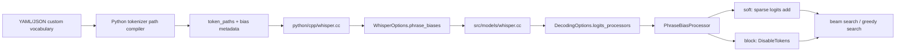
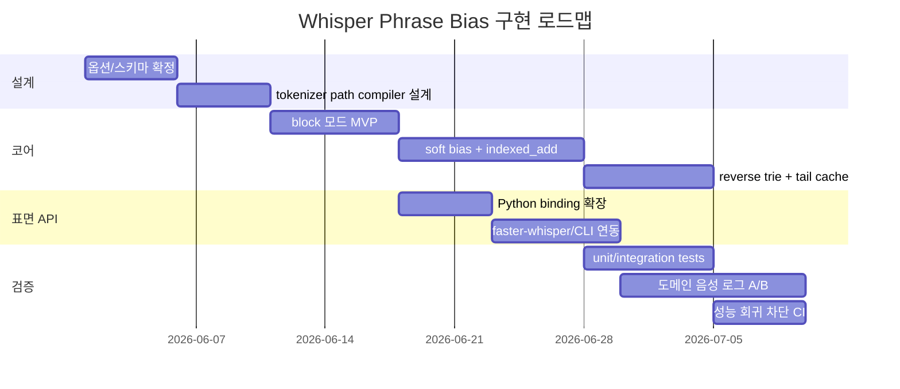

# CTranslate2 Whisper 코드베이스 기반 도메인 용어 Phrase Bias 설계 보고서

## 경영 요약

첨부된 CTranslate2/Whisper 코드베이스를 기준으로 보면, **도메인 용어 positive bias와 오인식 negative bias를 Whisper 디코더 내부에 넣는 가장 자연스러운 지점은 기존 `LogitsProcessor` 파이프라인**입니다. 현재 Whisper 경로는 `WhisperReplica::generate`에서 `DecodingOptions`를 만들고, `GetNoSpeechProbs`와 `ApplyTimestampRules` 같은 `LogitsProcessor`를 붙인 뒤 `decode()`를 호출합니다. 또 공통 디코딩 루프는 step마다 `logits`, `DisableTokens`, 현재 `sequences`, `batch_offset`, `prefix`를 `LogitsProcessor::apply`에 전달하므로, **“현재 beam의 suffix를 보고 다음 token에 가중치를 주는” phrase bias 문제와 구조적으로 잘 맞습니다.** citeturn2view2turn2view4turn15view1turn15view2

핵심 권고안은 세 단계입니다. **첫째**, MVP는 `block` 모드와 `soft` 모드를 모두 지원하되, block은 기존 `SuppressSequences`/`DisableTokens` 패턴을 재사용하고, soft bias는 새 sparse `indexed_add` 경로를 추가하는 방식으로 구현합니다. **둘째**, 매 step마다 모든 phrase를 순회하는 naïve scan 대신, **reverse trie + 짧은 tail cache**를 기본 구조로 쓰고, vocabulary가 매우 커질 때만 automaton 단계로 확장합니다. **셋째**, BPE/byte-level variability는 CT2 코어 안에서 문자열로 풀지 말고, **Python/faster-whisper 쪽에서 surface form을 `token_paths`로 미리 컴파일해서 CT2에는 token ID path만 넘기도록 분리**하는 편이 성능과 유지보수 두 측면에서 가장 안전합니다. citeturn15view3turn15view4turn3view1turn10view1turn9view0turn9view1

또 하나 중요한 결론은 **faster-whisper의 현재 `hotwords`는 decoder-native logit bias가 아니라 prompt/hint 성격**이라는 점입니다. 문서와 코드상 `hotwords`는 `get_prompt()` 쪽으로 들어가며, `prefix`가 주어지면 효과가 없습니다. 따라서 “트랜스포머” 같은 용어를 **정확히 next-token score 차원에서 bias**하고 싶다면, prompt 기반 hint만으로는 한계가 있고 **CT2 코어에 phrase-level bias를 넣는 편이 더 정확한 해결책**입니다. citeturn17view1turn18view2turn17view2

마지막으로, **컴파일 가능한 커스텀 포크 전략은 현실적**입니다. CTranslate2는 공식적으로 source build와 Python wheel 빌드를 지원하고, CUDA/cuDNN·테스트·프로파일링 같은 CMake 옵션도 이미 갖추고 있습니다. 따라서 이 기능은 “운영 중 Python monkey patch”보다 **C++ 코어에 넣고 wheel/Docker 이미지로 배포하는 방식**이 적합합니다. citeturn12view1turn14view2turn4search10turn11search0

## 코드베이스 관찰

현재 Whisper 경로에서 bias 기능을 넣을 후보 지점은 명확합니다. 공개 CTranslate2 Whisper API는 `beam_size`, `patience`, `repetition_penalty`, `no_repeat_ngram_size`, `return_logits_vocab`, `return_no_speech_prob`, `suppress_blank`, `suppress_tokens` 등을 노출하지만, **Whisper 전용 `prefix_bias_beta`나 phrase bias 옵션은 노출하지 않습니다.** 반면 일반 `Translator` API 쪽은 `target_prefix`, `prefix_bias_beta`, `suppress_sequences` 같은 편향 디코딩 기능을 이미 갖고 있으며, 문서도 이를 별도 decoding feature로 설명합니다. 즉, **CTranslate2 생태계 안에 “biased decoding”의 전례는 있지만 Whisper 바인딩에는 아직 연결되지 않은 상태**라고 보는 것이 정확합니다. citeturn1view1turn16view0turn16view1turn13view0turn13view1

공개 저장소와 첨부 아카이브의 구조를 함께 보면, 실제로 손댈 파일은 제한적입니다. 아래 표의 “로컬 훅”은 첨부 ZIP 정적 검사 기준의 권장 참조 위치입니다.

| 파일 | 현재 역할 | 권장 변경 | 로컬 훅 |
|---|---|---|---|
| `include/ctranslate2/models/whisper.h` | Whisper 전용 옵션 구조 정의 | `PhraseBias` 관련 옵션 추가 | `WhisperOptions` 선언부 근처 |
| `src/models/whisper.cc` | Whisper generate 경로에서 `DecodingOptions` 구성 | `PhraseBiasProcessor`를 `logits_processors`에 연결 | `WhisperReplica::generate` 내부 |
| `include/ctranslate2/decoding_utils.h` | `DisableTokens`, `LogitsProcessor`, `SuppressSequences` 정의 | `PhraseBiasProcessor`, sparse logit adjust helper 선언 | 공통 processor 선언부 |
| `src/decoding_utils.cc` | processor 공통 구현 | reverse trie 매칭, block/soft apply 구현 | 공통 processor 구현부 |
| `include/ctranslate2/primitives.h` | low-level primitive 선언 | `indexed_add` primitive 추가 | primitive 선언부 |
| `src/cpu/primitives.cc` | CPU primitive 구현 | sparse add CPU 구현 | CPU primitive 구현부 |
| `src/cuda/primitives.cu` | CUDA primitive 구현 | sparse add CUDA 구현 | CUDA primitive 구현부 |
| `python/cpp/whisper.cc` | Python binding, kwargs 표면 API | `phrase_biases`/`compiled_phrase_bias` kwargs 추가 | `WhisperWrapper::generate`, `.def("generate", ...)` |
| `python/setup.py` | Python extension wheel 구성 | 로컬 버전 suffix·private wheel 전략 반영 | 빌드 스크립트 |
| `python/tests/...` / `tests/...` | Python/C++ 테스트 | unit·integration·A/B 테스트 추가 | Whisper/decoding 테스트 인접 |

이 표의 구조적 근거는 다음과 같습니다. `WhisperReplica::generate`는 현재 `return_no_speech_prob`일 때 `GetNoSpeechProbs`를, timestamps를 예측할 때 `ApplyTimestampRules`를 `decoding_options.logits_processors`에 추가한 뒤 `decode()`로 넘깁니다. 공통 decode 루프는 step마다 `DisableTokens disable_tokens(logits)`를 만들고, 등록된 `logits_processors`를 순회 호출합니다. 또 `DisableTokens`는 CPU에서는 직접 값 대입, GPU에서는 flat index를 모아 한 번에 `indexed_fill`하는 방식으로 구현되어 있어, **“block은 기존 구조를 재사용하고, soft bias만 sparse add를 추가”하는 설계가 자연스럽습니다.** citeturn2view2turn2view4turn15view1turn15view2turn15view4turn3view1

한편, faster-whisper 쪽은 현재 hotword를 low-level CT2 bias로 넘기지 않습니다. 코드는 `options.hotwords`를 `get_prompt()`에 넣어 prompt를 구성하고, 문서도 hotwords가 “hint phrase”이며 `prefix`가 있으면 효과가 없다고 설명합니다. 따라서 domain term bias를 **프롬프트 힌트가 아니라 디코더 점수 수정으로 구현하려면, fastest/cleanest path는 CT2 코어 확장**입니다. citeturn17view1turn17view2turn18view2



위 흐름은 현재 Whisper generate 경로가 `DecodingOptions.logits_processors`로 기능을 주입하는 방식과 정확히 맞물립니다. 따라서 새 기능은 모델 포맷을 바꾸지 않고도 **옵션 추가와 processor 추가만으로 주입 가능**합니다. citeturn2view2turn15view1turn15view2

## 도메인 용어 bias 설계

설계 목표는 단순합니다. **positive bias는 도메인 정답 경로를 밀어 주고, negative bias는 자주 나오는 오인식 경로를 눌러 주는 것**입니다. 그러나 Whisper는 byte-level BPE/tiktoken 계열 토크나이저를 쓰고, 앞 공백과 word boundary가 토큰 경계에 영향을 주기 때문에, 설계 단위는 문자열이 아니라 **surface form에 대응하는 하나 이상의 `token_path` 집합**이어야 합니다. Hugging Face Whisper tokenizer 문서의 `add_prefix_space` 설명과 OpenAI Whisper tokenizer의 `tiktoken.Encoding` 구성은 이 점을 뒷받침합니다. 아래 multi-path 설계는 이 문서화된 토크나이저 동작으로부터 도출한 보수적 설계입니다. citeturn9view0turn9view1turn10view1turn10view3

권장 low-level 데이터 모델은 다음과 같습니다.

```cpp
enum class PhraseBiasMode : int8_t {
  Soft = 0,   // logits += bias
  Block = 1   // disable next token
};

struct PhraseBiasPath {
  std::vector<size_t> ids;   // one tokenization path
  float start_bias = 0.0f;   // optional bias for first token
  float step_bias = 0.0f;    // bias for continuation tokens
  uint16_t min_prefix_len = 1;
  PhraseBiasMode mode = PhraseBiasMode::Soft;
};

struct PhraseBias {
  std::vector<PhraseBiasPath> token_paths;  // multi-path for one surface/alias set
};
```

이 모델은 두 가지 점에서 중요합니다. 첫째, **하나의 surface form이 여러 token path를 가질 수 있다**는 점을 직접 표현할 수 있습니다. 둘째, bias 스케줄을 `start_bias`와 `step_bias`로 분리해, “첫 토큰은 약하게, 이어지는 토큰은 더 강하게” 같은 실무적 제어가 가능합니다. 이는 CT2 Whisper가 현재 노출하는 단순 `suppress_tokens`보다 훨씬 정밀한 제어입니다. citeturn1view1turn16view0

추천 bias 식은 아래처럼 단순하게 두는 편이 좋습니다.

```text
matched_len = 현재 beam suffix와 path prefix가 일치한 길이

if matched_len == 0:
    effective_bias = start_bias
else if matched_len >= min_prefix_len:
    effective_bias = start_bias + (matched_len - min_prefix_len + 1) * step_bias
else:
    effective_bias = 0
```

실무적으로는 **positive path는 `start_bias > 0`, negative path는 보통 `start_bias = 0`**이 안전합니다. negative bias를 첫 토큰부터 강하게 걸면 일반 토큰을 과도하게 누를 위험이 크기 때문입니다. 반대로 positive bias는 rare proper noun을 “시작하게” 만드는 약한 nudging이 유용할 수 있습니다. 이 권고는 기존 `SuppressSequences`가 이미 “마지막 토큰만 block”하는 suffix-prefix 패턴을 쓰고 있다는 점, 그리고 CT2 공통 decode 루프가 step별 processor 적용을 허용한다는 점을 바탕으로 한 설계적 확장입니다. citeturn15view3turn15view1turn15view2

가장 중요한 구현 선택은 **naïve scan이 아니라 reverse trie**입니다. 아이디어는 각 path의 모든 prefix를 뒤집어서 trie에 넣고, 매 step마다 현재 sequence의 뒤쪽 몇 토큰만 거꾸로 따라가며 매칭하는 방식입니다. 예를 들어 `트랜스포머`의 한 path가 `[A, B, C]`이면, root에는 첫 토큰 `A`용 start action을 둘 수 있고, reversed-prefix trie에는 `[A]` 노드에 “다음은 `B`를 bias”, `[B, A]` 노드에 “다음은 `C`를 bias”라는 action을 붙입니다.

```cpp
// 개념적 의사코드
for each batch_beam row:
  tail = last max_path_len_minus_1 tokens of current sequence
  node = trie.root
  collect root start actions
  for token in reverse(tail):
    if !node.has_child(token): break
    node = node.child(token)
    collect node.actions   // each action says: next_token, mode, bias
  apply collected actions to current row
```

이 방식은 `SuppressSequences`가 이미 “현재 sequence의 suffix를 보고 다음 token을 막는” 형태로 동작한다는 점과 잘 맞고, path 수가 늘어도 per-step 비용을 **경로 수가 아니라 tail 길이에 주로 비례**하게 줄여 줍니다. citeturn15view3turn3view1

설계 옵션은 아래처럼 정리할 수 있습니다.

| 방식 | 장점 | 단점 | 권장 시점 |
|---|---|---|---|
| Naïve suffix scan | 구현이 가장 단순함 | path 수가 늘면 step 비용이 빠르게 증가 | POC, path ≤ 128 |
| Reverse trie | 구현 난이도와 성능의 균형이 좋음 | trie 빌드와 action 관리가 약간 필요 | 기본 권장 |
| Aho-Corasick/automaton | 가장 큰 vocabulary에서 유리 | beam reorder 상태를 유지하려면 인터페이스 변경이 커짐 | path 수가 매우 클 때만 |

이 비교는 CTranslate2가 beam search/generation 성능 최적화에 민감한 런타임이고, beam search 자체가 speed/memory를 희생하는 알고리즘이라는 공식 문서 전제를 고려한 것입니다. 따라서 bias도 **MVP에서는 reverse trie**, automaton은 “필요할 때만” 가는 것이 맞습니다. citeturn13view0turn11search0

soft와 block은 경쟁 관계가 아니라 **역할 분담**으로 보는 편이 좋습니다.

| 모드 | 권장 용도 | 구현 비용 | 부작용 |
|---|---|---:|---|
| Soft positive | 정답 도메인 용어 recall 향상 | 중간 | insertion 증가 가능 |
| Soft negative | 대표 오인식 억제 | 중간 | 억제가 약하면 효과 제한 |
| Block | 매우 확실한 금지 경로 차단 | 낮음 | 잘못 쓰면 정상 발화도 차단 |
| Hybrid | 초반 soft, 마지막 토큰 직전 block | 높음 | 정책 튜닝 필요 |

기존 코드베이스에는 이미 sequence-level blocking(`SuppressSequences`)과 token-level blocking(`DisableTokens`)의 전례가 있으므로, **MVP는 block을 먼저, production 품질은 soft+block hybrid**가 자연스럽습니다. citeturn15view3turn15view4turn3view1

## CTranslate2 구현 계획

가장 작은 변경으로 가장 큰 효과를 내려면, **공통 `LogitsProcessor` 경로는 재사용하고 Whisper 전용 옵션만 추가**하는 편이 좋습니다. 공개 코드 기준으로 `WhisperOptions`를 추가 확장하고, `WhisperReplica::generate`에서 `PhraseBiasProcessor`를 하나 더 `decoding_options.logits_processors`에 붙이면 됩니다. 현재 Whisper generate는 이미 이 패턴으로 no-speech 계산과 timestamp 규칙을 주입합니다. citeturn2view2turn2view4turn15view2

권장 파일 수정 범위는 아래와 같습니다.

| 파일 | 변경 내용 |
|---|---|
| `include/ctranslate2/models/whisper.h` | `PhraseBiasMode`, `PhraseBiasPath`, `PhraseBias`, `std::vector<PhraseBias> phrase_biases` 추가 |
| `include/ctranslate2/decoding_utils.h` | `PhraseBiasProcessor`, `SparseLogitsAdjustments` 선언 |
| `src/decoding_utils.cc` | reverse trie 빌드, per-step 매칭, block/soft apply 구현 |
| `include/ctranslate2/primitives.h` | `indexed_add` primitive 선언 |
| `src/cpu/primitives.cc` | CPU sparse add 구현 |
| `src/cuda/primitives.cu` | CUDA sparse add 구현 |
| `src/models/whisper.cc` | `PhraseBiasProcessor` 생성 및 `decoding_options.logits_processors`에 연결 |
| `python/cpp/whisper.cc` | Python kwargs와 `WhisperOptions` 매핑 추가 |
| `python/setup.py` | 내부 wheel version suffix/배포 정책 반영 |
| 테스트 파일 | C++ unit + Python integration 추가 |

아래는 권장 API 표면입니다.

```cpp
// include/ctranslate2/models/whisper.h
struct PhraseBiasPath {
  std::vector<size_t> ids;
  float start_bias = 0.f;
  float step_bias = 0.f;
  uint16_t min_prefix_len = 1;
  PhraseBiasMode mode = PhraseBiasMode::Soft;
};

struct PhraseBias {
  std::vector<PhraseBiasPath> token_paths;
};

struct WhisperOptions {
  // existing fields...
  std::vector<PhraseBias> phrase_biases;
};
```

이 추가는 완전히 additive이므로, 옵션이 비어 있으면 기존 동작과 동일하게 유지할 수 있습니다. 현재 Whisper Python 바인딩도 `WhisperOptions`를 단순 필드 복사로 채우는 구조라, 새 필드 추가는 API 확장 방식으로 무난합니다. citeturn16view2turn16view4turn1view1

processor 자체는 다음처럼 두는 편이 맞습니다.

```cpp
// include/ctranslate2/decoding_utils.h
class PhraseBiasProcessor : public LogitsProcessor {
public:
  explicit PhraseBiasProcessor(std::vector<PhraseBias> phrase_biases);

  bool apply_first() const override {
    return false;  // no_speech_prob capture를 오염시키지 않음
  }

  void apply(dim_t step,
             StorageView& logits,
             DisableTokens& disable_tokens,
             const StorageView& sequences,
             const std::vector<dim_t>& batch_offset,
             const std::vector<std::vector<size_t>>* prefix) override;

private:
  ReverseTrie _trie;
  size_t _max_path_len = 0;
  mutable PerStepTailCache _cache;
};
```

`apply_first=false`가 중요한 이유는, Whisper는 step 0에서 `<|nospeech|>` 확률을 따로 잡기 위해 `GetNoSpeechProbs`를 먼저 적용하기 때문입니다. phrase bias가 그보다 먼저 실행되면 no-speech 확률 자체를 오염시킬 수 있습니다. 현재 코드 구조상 no-speech processor는 `apply_first()`로 우선 실행되도록 되어 있습니다. citeturn2view1turn15view2

Whisper 쪽 hook은 다음 한 덩어리로 충분합니다.

```cpp
// src/models/whisper.cc, WhisperReplica::generate 내부
if (!options.phrase_biases.empty()) {
  decoding_options.logits_processors.emplace_back(
    std::make_shared<PhraseBiasProcessor>(options.phrase_biases));
}
```

이 hook은 `GetNoSpeechProbs`를 등록한 뒤, 또는 timestamp rule 등록 전후에 둘 수 있습니다. 제 권고는 **no-speech 이후, timestamp rule과 같은 레벨의 일반 processor**로 넣는 것입니다. timestamp rule은 결국 `DisableTokens`를 통해 유효하지 않은 timestamp를 막기 때문에, phrase bias보다 뒤에 있어도 최종 유효성은 보장됩니다. citeturn2view2turn15view1

soft mode를 위해서는 `DisableTokens`와 별도의 sparse logit update 경로가 필요합니다. 현재 `DisableTokens`는 CPU에서는 direct assign, GPU에서는 flat index를 모아 `primitives::indexed_fill`을 호출합니다. 이 패턴은 “특정 index에 값을 써 넣는” block에는 맞지만, **positive/negative bias처럼 `+= delta`가 필요한 케이스에는 그대로 쓸 수 없습니다.** 따라서 아래처럼 새 helper를 두는 것이 가장 깔끔합니다. citeturn15view4turn3view1

```cpp
class SparseLogitsAdjustments {
public:
  void add(dim_t batch_id, dim_t token_id, float delta);
  void apply(StorageView& logits);  // internally indexed_add
private:
  std::vector<int32_t> _flat_indices;
  std::vector<float> _delta_values;
};
```

GPU/CPU device handling은 이렇게 가는 편이 좋습니다. **CPU와 GPU 모두 “한 번 모아서 한 번 적용”**이 기본입니다. CPU는 정말 소수 업데이트라면 직접 더해도 되지만, dtype 가정이 섞이면 유지보수가 나빠집니다. CT2는 이미 `DEVICE_AND_TYPE_DISPATCH`와 `primitives::indexed_fill`, `primitives::penalize_previous_tokens` 같은 sparse/selected update 전례가 있으므로, **`indexed_add`를 primitive로 넣고 CPU/CUDA 각각 한 번씩 구현**하는 편이 안정적입니다. GPU에서는 `(flat_index, delta)`를 미리 dedupe/reduce 한 뒤 unique index에 대해 한 번만 add하도록 하면 atomic 불확실성도 줄일 수 있습니다. citeturn3view1turn15view4

Python 바인딩 표면은 다음처럼 additive하게 두면 됩니다.

```python
# python/cpp/whisper.cc가 노출할 표면 예시
model.generate(
    features,
    prompts,
    beam_size=5,
    phrase_biases=[
        {
            "token_paths": [
                {"ids": [123, 456, 789], "start_bias": 0.15, "step_bias": 0.60, "min_prefix_len": 1, "mode": "soft"},
                {"ids": [111, 222],      "start_bias": 0.10, "step_bias": 0.50, "min_prefix_len": 1, "mode": "soft"},
            ]
        },
        {
            "token_paths": [
                {"ids": [333, 444, 555], "start_bias": 0.00, "step_bias": -0.90, "min_prefix_len": 2, "mode": "soft"},
            ]
        },
    ],
)
```

이 설계의 중요한 원칙은 **문자열 토큰화를 CT2 C++ 안으로 끌고 들어오지 않는 것**입니다. Python/faster-whisper 쪽이 tokenizer와 locale/alias를 더 잘 알고 있으므로, token path는 바깥에서 만들고 CT2는 numeric path만 처리해야 합니다. 공개 Whisper Python 바인딩이 현재도 Python kwargs를 `WhisperOptions` 필드에 매핑하는 얇은 레이어라는 점을 고려하면, 이 분리가 가장 일관적입니다. citeturn16view2turn16view4

## 성능과 빌드 전략

이 기능은 성능이 핵심입니다. faster-whisper는 CTranslate2를 쓰는 이유 자체가 속도와 메모리 효율 때문이고, 공개 벤치마크도 GPU/CPU에서 speed advantage를 보여 줍니다. CTranslate2 역시 공식적으로 quantization, layer fusion, batch reordering 같은 런타임 최적화를 강조합니다. 그러므로 phrase bias 구현은 **옵션이 꺼졌을 때 오버헤드가 0에 가까워야 하고**, 켜졌을 때도 sparse path만 따라가야 합니다. citeturn1view2turn11search0

권장 복잡도 기준은 아래와 같습니다.

| 구조 | 대략적 per-step 비용 | 메모리 | 권장 범위 |
|---|---:|---:|---|
| Naïve path scan | `O(B * P * L)` | 낮음 | POC, path 수 적음 |
| Reverse trie | `O(B * L_cap + U)` | 중간 | 기본 권장 |
| Automaton + persistent state | `O(B + U)` 근사 | 높음 | 매우 큰 vocabulary |

여기서 `B`는 batch×beam rows, `P`는 token path 수, `L`은 평균 path 길이, `L_cap`은 최대 path 길이, `U`는 실제 업데이트 수입니다. Whisper beam size가 beam search에서 속도와 메모리를 희생한다는 공식 문서 전제까지 감안하면, **MVP는 reverse trie가 가장 합리적**입니다. citeturn13view0

실무 임계값은 다음처럼 두는 것을 권합니다. **총 token path 수가 128 이하**이고 평균 길이가 4 이하이면 naïve scan으로도 충분히 통과할 가능성이 큽니다. **128~5000 path** 구간은 reverse trie가 기본값이어야 합니다. **5000 path를 넘기거나 multi-tenant per-domain vocabulary가 매우 크다면** automaton 후보를 검토하되, 그 단계부터는 beam reorder와 per-beam state 전달을 위해 decode loop 인터페이스를 더 크게 바꿀 가능성이 높습니다. 이 구분은 코드베이스가 현재 제공하는 정보만으로 가능한 변경 폭과 성능 리스크를 함께 본 실무적 분류입니다. citeturn15view1turn15view2turn11search0

per-beam state는 **MVP에서는 “현재 tail 기반 cache” 정도로 제한**하는 것이 좋습니다. 현재 `LogitsProcessor::apply`는 `beam_origins`를 받지 않기 때문에, beam search 재정렬 이후 상태를 processor 내부에서 완벽하게 들고 가려면 decode loop 인터페이스 자체를 늘려야 합니다. 그러나 매 step의 `alive_seq`는 이미 processor에 전달되므로, **마지막 `max_path_len-1` 토큰만 해시해 per-step cache를 두면 상당수 중복 계산을 줄일 수 있습니다.** 즉, correctness는 `alive_seq` 재계산으로 보장하고, optimization만 cache로 얹는 구조가 현재 코드베이스와 가장 잘 맞습니다. citeturn15view1turn15view2

soft mode의 sparse add는 다음 원칙을 지켜야 합니다. **첫째**, 같은 `(batch,row,token)`에 여러 path가 bias를 걸 수 있으므로 final apply 전에 dedupe/reduce 해야 합니다. **둘째**, GPU에서는 작은 수의 unique index만 업데이트하도록 sparse kernel을 한 번만 호출해야 합니다. **셋째**, 옵션이 disabled면 processor 자체를 만들지 않아야 합니다. `WhisperReplica::generate`가 이미 `options.return_no_speech_prob`나 timestamp 여부에 따라 processor를 조건부로 추가하는 구조이므로, phrase bias도 같은 패턴을 쓰면 disabled path의 추가 비용을 최소화할 수 있습니다. citeturn2view2turn15view1turn15view2

권장 마이크로벤치마크는 아래와 같습니다.

| 벤치마크 | 설정 | 측정값 |
|---|---|---|
| Processor off baseline | beam 1/5, CPU/GPU, bias off | p50/p95 latency, tokens/s |
| Naïve vs trie | path 32/128/512/2048 | added ms/step, CPU time share |
| Soft vs block | same vocabulary, same beam | added ms/step, memory delta |
| Path explosion | alias/path 수 증가 | compile time, per-call setup time |
| Real domain A/B | bias off/on | CER/WER, domain recall/precision, insertion ratio |
| Negative bias stress | 대표 오인식 세트 | misrecognition rate, false suppression rate |

특히 꼭 봐야 할 숫자는 **end-to-end latency**, **tokens/sec**, **per-step added ms**, **CPU/GPU memory delta**, **domain term recall/precision**, **insertion ratio**입니다. domain recall이 올라가도 insertion이 같이 오르면 production 품질은 오히려 악화될 수 있기 때문입니다. citeturn1view2turn11search0

빌드와 배포는 충분히 가능합니다. CTranslate2는 공식적으로 source build, pybind11 기반 Python wrapper build, 그리고 wheel 빌드를 지원합니다. 문서상 C++ 라이브러리는 CMake로 빌드하고, Python wrapper는 `python setup.py bdist_wheel`로 wheel을 만들 수 있으며, `CTRANSLATE2_ROOT`로 커스텀 설치 루트를 지정할 수 있습니다. 또한 `BUILD_TESTS`, `ENABLE_PROFILING`, `WITH_CUDA`, `WITH_CUDNN` 같은 옵션도 이미 문서화되어 있습니다. citeturn12view1turn14view2

```bash
mkdir build && cd build
cmake .. \
  -DBUILD_TESTS=ON \
  -DENABLE_PROFILING=OFF \
  -DWITH_CUDA=ON \
  -DWITH_CUDNN=ON
make -j$(nproc)
sudo make install
sudo ldconfig

cd ../python
CTRANSLATE2_ROOT=/usr/local python setup.py bdist_wheel
pip install dist/*.whl
```

이 빌드 흐름은 공식 설치 문서와 Python `setup.py` 구조에 그대로 올라탈 수 있습니다. production에서는 profiling을 끄고, benchmark 전용 빌드에서만 profiling을 켜는 편이 좋습니다. citeturn12view1turn14view2

## 토크나이저와 인터페이스

Whisper tokenizer 쪽은 이 설계의 핵심 리스크입니다. OpenAI Whisper tokenizer는 multilingual 경로에서 `tiktoken.Encoding`을 만들고, 정규식 패턴(`pat_str`)과 special tokens를 설정합니다. Hugging Face Whisper tokenizer 문서도 `add_prefix_space`가 leading word를 일반 단어처럼 다루게 하고, beginning-of-word를 앞 공백으로 판단한다고 설명합니다. 즉, **bias 대상 문자열은 “문자열 하나 = token path 하나”라고 가정하면 안 되고**, 최소한 앞 공백·띄어쓰기·대소문자·alias를 포함한 **surface-aware path set**으로 다뤄야 합니다. citeturn10view1turn10view3turn9view0turn9view1

권장 path compiler는 CT2 바깥에서 동작하는 오프라인/런타임 helper입니다. 알고리즘은 다음 순서가 적절합니다. 먼저 **canonical encode**를 구합니다. 그다음 **variant/alias**를 자동 생성합니다. 마지막으로 필요할 때만 **bounded DP path search**를 돌려 같은 surface를 만들 수 있는 대체 token path를 찾습니다. BPE 일반론상 subword 조합은 여러 방식으로 분해될 수 있으므로, 이 단계는 “문서화된 tokenizer 동작을 바탕으로 한 보수적 흡수층”이라고 보면 됩니다. citeturn9view2turn10view1turn9view0

권장 컴파일 절차는 다음과 같습니다.

```python
def compile_phrase_bias(tokenizer, surface, aliases=None, max_paths=16):
    variants = generate_variants(surface, aliases=aliases)
    token_paths = set()

    # canonical + common variants
    for v in variants:
        token_paths.add(tuple(tokenizer.encode(v)))

    # optional bounded DP over vocabulary pieces
    for v in variants:
        for ids in bounded_dp_enumerate_paths(
            tokenizer=tokenizer,
            surface=v,
            max_paths=max_paths,
            max_path_len_delta=2,
        ):
            if tokenizer.decode(ids) == v:
                token_paths.add(tuple(ids))
            if len(token_paths) >= max_paths:
                break

    return rank_and_trim(token_paths, max_paths=max_paths)
```

실제 구현에서는 Unicode 문자 단위보다 **tokenizer `decode(path) == surface` 검증**을 종착 조건으로 두는 편이 안전합니다. Whisper가 byte-level BPE/tiktoken 성격을 띠므로, 내부 후보 생성은 문자열 prefix 매칭으로 필터링하더라도 마지막 검증은 decode 동등성으로 닫는 것이 맞습니다. citeturn10view1turn9view1

path explosion을 막는 휴리스틱은 반드시 필요합니다. 권장 휴리스틱은 **`max_paths_per_surface = 16`**, **`max_path_len <= canonical_len + 2`**, **variant당 branch 상한**, **canonical과 짧은 path 우선 정렬**입니다. 또한 alias는 자동 생성만으로 끝내지 말고, 운영자가 직접 넣는 curated alias를 최상위 우선순위로 두는 편이 좋습니다. 한국어/영문 혼용 도메인에서는 “앞 공백 variant”, “공백 삽입 variant”, “ASCII casefold” 정도가 기본이고, 브랜드 표기나 사내 제품명은 수동 alias가 더 정확합니다. 이는 Whisper tokenizer의 앞 공백 민감성과 byte-level pre-tokenizer 일반론을 반영한 실무 휴리스틱입니다. citeturn9view0turn9view1

사용자 인터페이스는 low-level CT2와 high-level faster-whisper를 분리해 설계하는 편이 좋습니다. CT2 low-level은 **`token_paths`만 받는 숫자 API**로 두고, faster-whisper/CLI/YAML이 사람 친화적 surface config를 받아 compile한 뒤 넘기는 구조가 좋습니다. 현재 faster-whisper가 이미 `initial_prompt`, `prefix`, `hotwords`, `suppress_tokens`, `hallucination_silence_threshold` 등 런타임 옵션을 갖고 있으므로, 새로운 bias 인터페이스도 이 레이어에 추가하는 것이 자연스럽습니다. citeturn17view2turn7view0turn7view3

예시 JSON/YAML은 다음처럼 두는 것이 좋습니다.

```yaml
custom_vocabulary:
  - surface: "트랜스포머"
    aliases:
      - " 트랜스포머"
      - "트랜스 포머"
      - "Transformer"
      - " transformer"
    policy: positive
    mode: soft
    start_bias: 0.15
    step_bias: 0.60
    min_prefix_len: 1
    path_search: variants

  - surface: "트랜스퍼머"
    aliases:
      - " 트랜스퍼머"
    policy: negative
    mode: soft
    start_bias: 0.00
    step_bias: -0.80
    min_prefix_len: 2
    path_search: canonical

runtime:
  apply_scope: final_only        # off | all | final_only | suspicious_only
  per_domain_vocab: true
  enable_start_bias: true
  max_paths_per_surface: 16
```

이 인터페이스는 운영 요구에 맞는 런타임 제어를 포함해야 합니다. 특히 **`per_domain_vocab`**, **`per-segment gating`**, **`suspicious_only`**, **`final_only`**가 유용합니다. domain term bias는 실시간 partial보다 final segment나 재디코딩 결과에 더 강하게 거는 편이 insertive error를 덜 만들기 때문입니다. faster-whisper가 이미 여러 decoding/runtime knobs를 노출한다는 점을 보면, 이런 additive runtime control은 표면 API 철학과도 잘 맞습니다. citeturn17view2turn18view2

validation 규칙은 엄격해야 합니다.

| 규칙 | 이유 |
|---|---|
| `ids` 빈 경로 금지 | 무의미한 path 차단 |
| `min_prefix_len < len(ids)` 권장 | 마지막 토큰 직전만 bias하지 않게 하기 위함 |
| `mode=block`인데 positive bias 값 설정 금지 | 의미 충돌 방지 |
| `abs(start_bias), abs(step_bias)` 상한 설정 | 과도한 삽입/삭제 방지 |
| special token 포함 금지 | SOT/EOT/timestamp 오염 방지 |
| 중복 path dedupe | 불필요한 연산 방지 |

backward compatibility는 매우 중요합니다. 기본값은 `phrase_biases=None` 또는 빈 리스트여야 하고, 이 경우 **processor를 생성하지 않아 기존 출력과 latency가 사실상 동일**해야 합니다. 현재 Whisper API가 가변 kwargs를 필드 복사로 `WhisperOptions`에 싣는 구조라, additive field 추가는 후방 호환을 보장하기 쉽습니다. citeturn16view2turn1view1

## 검증과 운영 로드맵

테스트는 C++ unit, Python integration, 실제 도메인 음성 A/B의 세 층으로 나누는 것이 좋습니다. C++ unit에서는 reverse trie prefix 매칭, `indexed_add`의 CPU/CUDA 정확성, soft/block 상호작용, disabled 시 no-op를 검증합니다. Python integration에서는 실제 Whisper 변환 모델로 `generate()`에 새 kwargs를 넣어 domain term recall 변화와 regression을 확인합니다. 실제 도메인 음성 A/B에서는 사내 음성 로그를 써서 insertion 증가와 latency 증가를 꼭 함께 봐야 합니다. 공개 코드 기준으로 CTranslate2는 Whisper 변환·generate·encode·align을 이미 지원하므로, 새 기능도 같은 레이어에서 검증하는 것이 자연스럽습니다. citeturn1view1turn2view4turn16view0

권장 평가 지표는 아래와 같습니다.

| 범주 | 지표 |
|---|---|
| 정확도 | CER, WER |
| 도메인 | domain term recall, domain term precision |
| 부작용 | insertion ratio, substitution ratio |
| 오인식 억제 | misrecognition hit rate, false suppression rate |
| 운영 성능 | p50/p95 latency, tokens/sec, added ms/step |
| 자원 | CPU/GPU memory delta |
| 안정성 | disabled-baseline과의 diff, failure/timeout rate |
| 참고 | hallucination hit rate |

여기서 **domain recall/precision과 insertion ratio를 반드시 같이** 봐야 합니다. phrase bias는 recall은 쉽게 올리지만, 잘못 튜닝하면 없는 용어를 끼워 넣는 방향으로도 작동할 수 있기 때문입니다. citeturn13view0turn11search0

마이그레이션과 유지보수는 “작은 포크, additive 옵션, private wheel” 원칙으로 가는 편이 좋습니다. CTranslate2는 source build와 wheel build가 공식 지원되므로, `4.7.2+pb1` 같은 내부 버전 suffix를 붙여 private package registry나 내부 Docker 이미지를 배포하면 됩니다. rollback은 더 단순합니다. **기능 플래그를 꺼서 비활성화**하거나, **upstream wheel로 되돌리면 끝**입니다. source build와 Python wrapper build가 공식 문서에 이미 나와 있으므로, 이 전략은 운영적으로도 현실적입니다. citeturn12view1turn14view2

우선순위 로드맵은 아래가 적절합니다.



이 로드맵의 핵심은 **block 모드로 빨리 진입해 suffix-prefix 로직과 인터페이스를 먼저 안정화하고, 그다음 soft bias를 sparse add primitive로 올리는 것**입니다. 현재 코드베이스가 이미 `SuppressSequences`와 `DisableTokens`를 갖고 있으므로, block MVP가 가장 빠른 검증 경로입니다. 그 위에 soft bias를 얹는 쪽이 리스크가 낮습니다. citeturn15view3turn15view4turn3view1

주요 리스크와 대응은 아래와 같습니다.

| 리스크 | 영향 | 대응 |
|---|---|---|
| path explosion | setup time·메모리 증가 | path cap, variant cap, canonical 우선 |
| insertion 증가 | 정답률 체감 악화 | start_bias 낮게, A/B로 precision 함께 측정 |
| GPU sparse add overhead | latency 증가 | dedupe 후 1회 적용, block 우선 출시 |
| beam reorder state 복잡성 | 구현 난도 상승 | MVP는 persistent state 없이 `alive_seq` 재계산 |
| tokenizer alias 누락 | bias 실효성 저하 | curated alias 지원, offline compiler |
| upstream drift | 포크 유지비 증가 | 변경 파일 최소화, 월간 rebase, regression CI |
| 표면 API 혼선 | 운영 사용성 저하 | CT2 low-level 숫자 API + wrapper high-level config 분리 |

현재 시점의 열린 질문과 가정은 다음과 같습니다.

| 항목 | 현재 가정 |
|---|---|
| 첨부 ZIP 정확한 Git SHA | ZIP 이름상 master 계열이나 SHA는 확인 불가 |
| Whisper tokenizer 구현 소스 | OpenAI Whisper/tiktoken 계열과 HF Whisper tokenizer 설명을 기준으로 설계 |
| 목표 beam size | 실무 기본값 1 또는 5 가정 |
| 예상 vocabulary 크기 | 도메인 단위 수십~수백 surface, 대규모 시 수천 path 가능 |
| 적용 범위 | Whisper CT2 low-level + faster-whisper wrapper 우선 |
| streaming 정책 | partial보다 final/re-decode 우선 적용 권장 |
| negative bias 강도 | start_bias 0, continuation 위주를 기본값으로 가정 |

종합하면, **가장 현실적인 구현 순서**는 이렇습니다. 먼저 `WhisperOptions`에 additive 옵션을 넣고, `src/models/whisper.cc`에서 `PhraseBiasProcessor`를 `logits_processors`에 연결합니다. 그다음 block 모드로 suffix-prefix 로직을 먼저 입증합니다. 이후 `indexed_add` primitive를 넣어 soft positive/negative bias를 완성합니다. 마지막으로 tokenizer path compiler와 faster-whisper CLI/YAML 인터페이스, 그리고 도메인 음성 로그 A/B 및 성능 회귀 CI를 붙이면 됩니다. 이 경로는 현재 CTranslate2 Whisper 구조, faster-whisper의 표면 API 철학, 그리고 공식 빌드/배포 체계와 가장 잘 맞는 설계입니다. citeturn2view2turn15view1turn16view2turn17view2turn12view1turn14view2