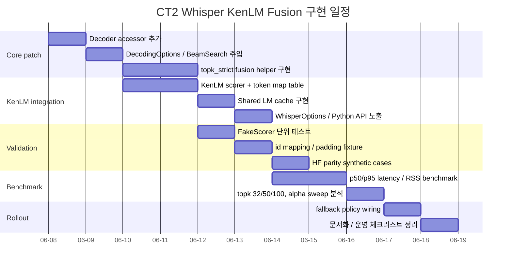

# CT2 Whisper KenLM BPE Fusion 구현 계획

## 요약

첨부한 CT2 코드 아카이브를 기준으로 보면, **KenLM BPE token-id shallow fusion을 CT2 Whisper beam search에 넣는 작업은 충분히 가능**하고, 가장 안전한 방식은 **`BeamSearch::search()` 내부에서 기존 `sampler(...)` 호출 직전 분기**를 하나 추가해 `topk_strict` 후보 선택만 대체하는 것입니다. 핵심은 `Sampler`와 `SearchStrategy`의 큰 구조는 그대로 두고, `BeamSearch`가 최종적으로 필요로 하는 세 산출물인 `topk_ids`, `topk_scores`, `gather_indices`만 fusion helper가 동일한 형태로 만들어 주게 하는 것입니다. CT2 Python Whisper API는 기본 `beam_size=5`를 사용하고, `inter_threads`는 여러 batch/request를 병렬 처리하는 worker 수로 설명되어 있어, Whisper beam path와 multi-worker 운영 설계를 이 전제 위에 맞추는 것이 자연스럽습니다. citeturn1view2turn1view1

가장 중요한 결론은 두 가지입니다. 첫째, **삽입 지점은 `src/decoding.cc`의 `BeamSearch::search()`에서 beam cumulative score를 `log_probs`에 더한 뒤, `reshape + sampler + unflatten_ids`로 들어가기 직전**입니다. 첨부 코드 기준으로는 `src/decoding.cc:549-565` 인근입니다. 둘째, **현재 CT2의 output-id → original-id 매핑은 “유효 후보”에 대해서는 맞지만, padding output id에 대해서는 원래 token `0`으로 되돌아가도록 설계되어 있어서 LM fusion에는 그대로 쓰면 위험**합니다. 따라서 `Decoder`에 `effective_output_size()` 또는 `is_padding_output_id()` accessor를 추가하는 것이 사실상 필수입니다. 이 판단은 첨부 코드의 `Decoder::update_output_layer`, `Decoder::to_original_word_id`, `BeamSearch::convert_to_original_word_ids`, 그리고 모델 테스트가 padding output id를 `0`으로 기대하는 동작을 함께 보면 분명합니다. citeturn0search7turn0search3

KenLM 쪽은 **runtime에서 binary LM을 쓰는 것이 맞고**, probing은 더 빠르지만 메모리를 더 쓰고, trie는 메모리를 덜 쓰지만 조금 느립니다. 또한 KenLM은 확률을 **log10**으로 제공하므로 CT2 쪽에서 Whisper log-prob와 합칠 때는 `ln(10)` 스케일 변환이 필요합니다. 아울러 KenLM은 `virtual_interface.hh` 또는 `model.hh` 기반으로 query-only 통합이 가능하고, binary는 `mmap` 기반 로드가 지원됩니다. citeturn1view3turn5view2turn10search7

| 질문 | 구현 결론 |
|---|---|
| 가장 안전한 삽입 위치 | `src/decoding.cc` `BeamSearch::search()`에서 `add_depth_broadcast` 직후, `reshape + sampler` 직전 |
| id 매핑은 맞는가 | **조건부로만 맞음**. non-padding output id는 맞고, padding output id는 `0`으로 붕괴되므로 accessor 추가 필요 |
| beam reorder / finished prune | `active_beams` gather → `non_finished_index` keep_batches 순서로 LM state도 똑같이 따라가야 함 |
| KenLM shared model 가능성 | **가능성이 높음**, 다만 공식 문서에서 강한 thread-safety 보증을 찾지는 못했으므로 TSAN/스트레스 검증 필요 |
| worker/cache 전략 | **LM model은 path-keyed shared cache**, LM state는 request/beam local |
| LM 크기와 속도/메모리 | CPU라도 영향 큼. probing/trie, 3g/4g/5g, mmap/load method를 실제로 벤치해야 함 |
| production 기본 topk | **초기 기본값은 50 권장**, 32/50/100 sweep으로 lock |
| 최소 침습 패치 | `BeamSearch`, `DecodingOptions`, `Decoder accessor`, `WhisperOptions/API` 중심으로만 수정 |

## 매핑 검증

첨부 코드 기준으로 현재 매핑은 이렇게 동작합니다.

`src/layers/decoder.cc:81-138`에서 `update_output_layer()`는 output layer를 preferred size multiple에 맞추기 위해 **padding slot을 뒤에 추가**하고, 그 padding 위치의 원래 id를 모두 `0`으로 채운 뒤 extra bias를 `-1e10`로 넣습니다. 그리고 `include/ctranslate2/layers/decoder.h:67-72`의 `to_original_word_id()`는 `_to_original_word_id[output_id]`를 그대로 반환합니다. 즉, **padding output id는 “invalid”가 아니라 “original token 0”으로 역매핑**됩니다. 첨부 테스트 `tests/model_test.cc:40-44`도 이 동작을 그대로 검증합니다. Whisper 쪽에서는 `src/models/whisper.cc:254`에서 매 generation마다 `_decoder->update_output_layer(_model->preferred_size_multiple())`를 호출하고, CUDA fp16/bf16 경로에서는 preferred size multiple이 8이 될 수 있으므로 padding output이 실제로 생길 수 있습니다. 이 구조 자체는 CT2의 기존 설계와 일관되지만, **LM fusion 관점에서는 그대로 사용하면 안 됩니다.** citeturn0search7turn0search3turn7search4

따라서 매핑에 대한 최종 판정은 이렇게 정리하는 것이 정확합니다.

- **유효 output id < effective_output_size** 에 대해서는 매핑이 맞습니다.
- **padding output id >= effective_output_size** 에 대해서는 매핑이 “의미론적으로 틀립니다”. 현재는 `0`으로 되돌아가므로 KenLM 입장에서는 `t0`를 본 것처럼 잘못 해석될 수 있습니다.
- 결론적으로, **현재 매핑 구현은 CT2 decoding용으로는 괜찮지만, LM fusion용으로는 accessor가 하나 더 필요합니다.**

권장 패치는 `Decoder`에 아래 두 개를 추가하는 것입니다.

```cpp
// include/ctranslate2/layers/decoder.h
dim_t effective_output_size() const {
  return output_layer_is_updated() ? _effective_output_size : output_size();
}

bool is_padding_output_id(size_t output_id) const {
  return output_layer_is_updated()
      && output_id >= static_cast<size_t>(_effective_output_size)
      && output_id < static_cast<size_t>(output_size());
}
```

그리고 `Decoder::update_output_layer()`에서 `_effective_output_size`를 **padding 전 크기**로 항상 저장합니다.

```cpp
// src/layers/decoder.cc
_effective_output_size = ids.empty() ? _vocabulary_size : ids.size();
// 그 다음 padding_size 계산/resize 수행
```

LM fusion helper에서는 `to_original_word_id()`를 호출하기 전에 반드시 이 accessor를 사용해야 합니다.

```cpp
if (decoder.is_padding_output_id(output_id)) {
  continue;  // 또는 -inf 취급
}
const size_t original_id = decoder.to_original_word_id(output_id);
```

Whisper 전용 token 범위는 `src/models/whisper.cc:74-77`의 주석대로 **text tokens → `<|endoftext|>` → Whisper special/task/timestamp tokens** 순서이므로, 실전 구현에서는 `original_id < _eot_id` 인 경우만 LM score를 적용하고, 그 외 special/timestamp는 **LM score도 주지 않고 LM state도 advance하지 않는** 것이 맞습니다. citeturn1view2turn0search7

## 패치 설계

가장 안전한 삽입 위치는 첨부 코드 기준으로 `src/decoding.cc:549-565`입니다. 현재 beam search는 다음 순서로 흘러갑니다.

1. `decoder(...)`로 logits 계산
2. `DisableTokens`, logits processors 적용
3. `LogSoftMax` 또는 `biased_decoder->decode`
4. 이전 beam cumulative score를 `log_probs`에 broadcast add
5. `log_probs.reshape({cur_batch_size, -1})`
6. `sampler(log_probs, topk_ids, topk_scores, num_candidates)`
7. `unflatten_ids(topk_ids, ...)`

`topk_strict` fusion은 이 중 **4번이 끝난 직후, 5~7번을 조건부로 대체**하는 구조가 가장 깔끔합니다. 즉, fusion이 꺼져 있으면 기존 경로를 그대로 타고, fusion이 켜져 있으면 새 helper가 같은 출력 형식의 `topk_ids`, `topk_scores`, `gather_indices`를 직접 만들어 줍니다. 이렇게 하면 이후 `update_sample_with_prefix`, `append_step_output`, hypothesis finalization, decoder KV state reorder 코드는 최대한 그대로 재사용할 수 있습니다. CT2의 `Sampler`는 이미 GPU 점수 텐서에 대해 device-side sampling을 수행한 뒤 결과 `sampled_ids`와 `sampled_scores`를 CPU로 복사하는 구조이므로, 새 helper도 이 패턴을 따라가면 됩니다. citeturn8view0turn1view2

### 변경 파일과 API

| 파일 | 변경 내용 |
|---|---|
| `include/ctranslate2/lm_fusion.h` | `LmFusionOptions`, `LmStateBatch`, `LmScorer` 신규 추가 |
| `include/ctranslate2/decoding.h` | `DecodingOptions`에 `lm_fusion`, `lm_scorer` 추가. `BeamSearch` ctor에 주입 필드 추가 |
| `src/decoding.cc` | `select_topk_strict_fused_candidates()` helper 추가, LM state gather/prune 로직 추가 |
| `include/ctranslate2/layers/decoder.h` | `effective_output_size()`, `is_padding_output_id()` accessor 추가 |
| `src/layers/decoder.cc` | `_effective_output_size` 추적 로직 추가 |
| `include/ctranslate2/models/whisper.h` | `WhisperOptions`에 `lm_path`, `lm_alpha`, `lm_topk`, `lm_fusion_mode` 추가 |
| `src/models/whisper.cc` | request별 LM cache lookup, `DecodingOptions` wiring |
| `python/cpp/whisper.cc` | Python kwargs 노출 |
| `src/lm/kenlm_scorer.cc` | KenLM binary loader, token-id → WordIndex table, scorer 구현 |
| `src/lm/kenlm_cache.cc` | path-keyed shared cache 구현 |
| `tests/lm_fusion_test.cc` | FakeScorer unit tests |
| `python/tests/test_whisper_lm_fusion.py` | Python smoke/integration tests |

### 추가할 핵심 타입

```cpp
// include/ctranslate2/lm_fusion.h
namespace ctranslate2 {

  enum class LmFusionMode {
    Disabled,
    TopKStrict,
  };

  struct LmFusionOptions {
    LmFusionMode mode = LmFusionMode::Disabled;
    float alpha = 0.f;
    dim_t topk = 50;
    size_t text_token_limit = 0;   // Whisper: _eot_id
  };

  class LmStateBatch {
  public:
    virtual ~LmStateBatch() = default;
    virtual size_t size() const = 0;
    virtual void resize(size_t size) = 0;
    virtual std::unique_ptr<LmStateBatch> clone_empty(size_t size) const = 0;
  };

  class LmScorer {
  public:
    virtual ~LmScorer() = default;

    virtual std::unique_ptr<LmStateBatch> make_initial_states(size_t size) const = 0;

    virtual float score_token(const LmStateBatch& in_states,
                              size_t in_index,
                              size_t original_token_id,
                              LmStateBatch& out_states,
                              size_t out_index) const = 0;

    virtual void copy_state(const LmStateBatch& in_states,
                            size_t in_index,
                            LmStateBatch& out_states,
                            size_t out_index) const = 0;

    virtual void gather(const LmStateBatch& src,
                        const std::vector<int32_t>& indices,
                        LmStateBatch& dst) const = 0;

    virtual void keep_batches(const LmStateBatch& src,
                              const std::vector<int32_t>& kept_batch_ids,
                              dim_t beam_size,
                              LmStateBatch& dst) const = 0;
  };

}
```

이렇게 하면 CT2 core는 KenLM 타입을 직접 몰라도 되고, unit test에서 `FakeScorer`를 넣기도 쉬워집니다. 동시에 `BeamSearch`와 `DecodingOptions`의 공개 시그니처를 크게 흔들지 않아서 patch footprint도 작습니다.

### `BeamSearch::search()`에 넣을 분기

```cpp
// src/decoding.cc inside BeamSearch::search(), around local 549-565
std::unique_ptr<LmStateBatch> lm_states;
if (_lm_scorer && _lm_fusion.mode == LmFusionMode::TopKStrict && _lm_fusion.alpha > 0.f) {
  const size_t initial_size = expand_after_first_step ? batch_size : batch_size * _beam_size;
  lm_states = _lm_scorer->make_initial_states(initial_size);
}

...

// After log_probs already includes cumulative beam scores.
std::unique_ptr<LmStateBatch> step_next_states;
StorageView gather_indices;

if (_lm_scorer && _lm_fusion.mode == LmFusionMode::TopKStrict && _lm_fusion.alpha > 0.f) {
  FusedBeamCandidates fused = select_topk_strict_fused_candidates(
      decoder,
      log_probs,          // [rows, vocab]
      cur_batch_size,
      _beam_size,
      is_expanded,
      num_candidates,
      *_lm_scorer,
      _lm_fusion,
      *lm_states);

  topk_ids = std::move(fused.ids);               // CPU [cur_batch, num_candidates]
  topk_scores = std::move(fused.scores);         // CPU [cur_batch, num_candidates]
  gather_indices = std::move(fused.beam_origins);// CPU [cur_batch * num_candidates]
  step_next_states = std::move(fused.next_states);
} else {
  log_probs.reshape({cur_batch_size, -1});
  sampler(log_probs, topk_ids, topk_scores, num_candidates);
  gather_indices = unflatten_ids(topk_ids, _beam_size, vocabulary_size, is_expanded);
}
```

### helper의 실제 역할

`select_topk_strict_fused_candidates()`는 다음을 합니다.

1. `ops::TopK(_lm_fusion.topk)`로 **row-wise top-k**를 구함  
   shape: `[rows, topk]`, 여기서 `rows = is_expanded ? cur_batch_size * beam_size : cur_batch_size`
2. ids/scores를 CPU로 복사
3. 각 candidate에 대해  
   - padding output id면 버림  
   - output id → original id 변환  
   - `original_id >= text_token_limit` 이면 LM score 미적용 + state copy  
   - text token이면 `score += alpha * lm_logprob_ln`, state advance
4. 배치별로 `rows * topk` 후보를 모아 `nth_element` 또는 partial sort로 `num_candidates`개만 선택
5. 최종 `topk_ids`, `topk_scores`, `gather_indices`, `next_states` 반환

이 helper는 **기존 `reshape + sampler + unflatten_ids`의 drop-in 대체물** 역할만 해야 합니다. 그게 최소 침습입니다.

## 상태와 캐시

LM state 동기화는 첨부 코드의 `src/decoding.cc:683-710` 흐름을 그대로 따라가면 됩니다. 핵심은 **decoder KV state와 LM state의 “재배열 이벤트”를 1:1로 맞추는 것**입니다.

현재 beam search는 step이 끝나면

1. `active_beams`로 beam-level gather
2. `non_finished_index`로 batch-level prune
3. `decoder.update_state(...)`

순서로 상태를 정리합니다. LM state도 정확히 같은 순서로 정리해야 합니다.

### 권장 LM state 구조

| 타입 | 인덱싱 규칙 |
|---|---|
| `lm_states` | 현재 살아 있는 beam 상태. flat order는 CT2와 동일하게 `[batch0_beam0, ..., batchN_beamK]` |
| `step_next_states` | 현재 step의 `num_candidates` 후보 상태. flat order `[batch0_cand0..candM, batch1_cand0..]` |
| `selected_states` | `active_beams` gather 이후 `[cur_batch * beam_size]` |
| `next_lm_states` | `keep_batches` 적용 후 `[next_batch_size * beam_size]` |

### reorder / prune pseudocode

```cpp
// step_next_states: [cur_batch * num_candidates]
auto selected_states = step_next_states->clone_empty(cur_batch_size * _beam_size);

// active_beams is CPU [cur_batch * beam_size], values in [0, cur_batch*num_candidates)
std::vector<int32_t> active_indices(active_beams.size());
for (dim_t i = 0; i < active_beams.size(); ++i)
  active_indices[i] = active_beams.at<int32_t>(i);

_lm_scorer->gather(*step_next_states, active_indices, *selected_states);

// If some batches finished, keep only remaining batches.
if (next_batch_size != cur_batch_size) {
  auto pruned_states = selected_states->clone_empty(next_batch_size * _beam_size);
  _lm_scorer->keep_batches(*selected_states, non_finished_index, _beam_size, *pruned_states);
  lm_states = std::move(pruned_states);
} else {
  lm_states = std::move(selected_states);
}
```

### hard prefix 처리

여기서 실수하기 쉬운 부분이 바로 hard prefix입니다. 현재 CT2는 `update_sample_with_prefix(...)`가 `topk_ids/topk_scores/gather_indices`를 **사후 수정**합니다. 따라서 LM state를 helper 안에서 미리 계산해 두면, prefix step에서는 **선택된 token과 next-state가 어긋날 수 있습니다.**

최소 리스크 구현은 다음입니다.

- `use_hard_prefix && step < prefix_length` 인 step에서는 **그 batch에 대해 fusion scoring을 아예 건너뛴다**
- 기존 CT2 경로로 candidate를 뽑고 `update_sample_with_prefix()`로 강제 토큰을 반영한 뒤
- **최종 선택된 `topk_ids`를 original id로 변환해서 LM state만 advance** 한다
- special/timestamp는 LM state를 advance하지 않고 copy만 한다

이렇게 하면 forced token path와 LM state가 절대 어긋나지 않습니다.

### KenLM 캐시와 multi-worker

CT2 Whisper의 `inter_threads`는 여러 batch/request를 병렬 처리하는 model worker 수이고, Python API도 그 의미를 그대로 설명합니다. 따라서 `inter_threads`를 늘리면 KenLM query도 병렬로 증가합니다. 그래서 **LM model은 공유하고, LM state만 beam/request local로 두는 구조**가 가장 균형이 좋습니다. citeturn1view2turn1view1

권장 캐시 구조는 아래와 같습니다.

| 항목 | 권장 구조 |
|---|---|
| KenLM binary model | `lm_path` 기준 `shared_ptr<const KenlmModelHandle>` shared cache |
| request-level scorer wrapper | 가벼운 wrapper 가능. 없어도 됨 |
| per-beam state | `BeamSearch::search()` stack/request local |
| cache key | canonical path + file size/mtime 또는 artifact version |
| eviction | LRU 또는 max loaded models per process |

KenLM 문서에서는 binary format을 `mmap`으로 로드할 수 있고, `Config::load_method`로 lazy mmap / populate / read 등의 동작을 고를 수 있습니다. 또 probing은 더 빠르지만 메모리를 더 쓰고, trie는 메모리를 덜 쓰지만 조금 느립니다. 따라서 도메인별로 LM을 많이 올리는 멀티테넌트 환경이라면 **model shared cache + load_method 튜닝 + trie/probing 벤치**가 필요합니다. CPU라고 해서 영향이 없는 것이 아닙니다. citeturn1view3turn5view2

KenLM의 공식 문서에서 “이것은 완전히 thread-safe하다”는 강한 문장을 찾지는 못했지만, 공개 API는 caller가 `State`를 들고 `BaseScore`에 넣는 구조이고 예제도 model을 읽기 전용으로 사용합니다. 따라서 **shared immutable model + thread-local/request-local `State`** 설계는 합리적입니다. 다만 이 부분은 inference에 근거한 판단이므로, 실제 적용 전 TSAN 또는 스트레스 테스트를 돌리는 것이 맞습니다. citeturn6search0turn2search0

### KenLM scorer 구현 포인트

성능상 가장 중요한 최적화는 **string formatting을 런타임 query path에서 없애는 것**입니다. `t1234` 같은 pseudo-word를 매 step마다 만들면 낭비가 큽니다. 따라서 scorer 생성 시 `original_token_id -> WordIndex` 테이블을 미리 만들어 두는 것이 좋습니다.

```cpp
class KenlmStateBatch final : public LmStateBatch {
public:
  std::vector<lm::ngram::State> states;
  ...
};

class KenlmScorer final : public LmScorer {
public:
  explicit KenlmScorer(std::shared_ptr<const KenlmModelHandle> handle,
                       size_t text_token_limit)
    : _handle(std::move(handle))
    , _text_token_limit(text_token_limit)
    , _word_ids(text_token_limit) {
    const auto& vocab = _handle->model().BaseVocabulary();
    for (size_t tok = 0; tok < text_token_limit; ++tok) {
      _word_ids[tok] = vocab.Index(("t" + std::to_string(tok)).c_str());
    }
  }

  float score_token(const LmStateBatch& in_states,
                    size_t in_index,
                    size_t original_token_id,
                    LmStateBatch& out_states,
                    size_t out_index) const override {
    const auto& src = static_cast<const KenlmStateBatch&>(in_states);
    auto& dst = static_cast<KenlmStateBatch&>(out_states);
    const lm::WordIndex wid = _word_ids[original_token_id];
    const float lp10 = _handle->model().BaseScore(&src.states[in_index], wid, &dst.states[out_index]);
    return lp10 * std::log(10.f);
  }

  void copy_state(...) const override {
    ...
  }

private:
  std::shared_ptr<const KenlmModelHandle> _handle;
  size_t _text_token_limit;
  std::vector<lm::WordIndex> _word_ids;
};
```

실전 빌드에서는 `KENLM_MAX_ORDER`를 실제 사용할 n-gram order보다 너무 크게 잡지 않는 것도 중요합니다. KenLM README는 이 값이 state를 효율적인 POD로 유지하기 위한 것이라고 설명하므로, 5-gram만 쓸 계획이면 max order를 불필요하게 높이지 않는 편이 좋습니다. citeturn1view3

## 테스트와 벤치마크

테스트는 **unit → HF parity → E2E regression** 순서로 가는 것이 맞습니다. 특히 이번 패치는 “전사는 되는데 조용히 성능이 틀어지는” 버그가 가장 무서우므로, id mapping과 beam reorder는 강한 고정 테스트가 필요합니다.

### unit test 목록

| 테스트 | 파일 | 검증 포인트 |
|---|---|---|
| padding id mapping | `tests/lm_fusion_test.cc` | `is_padding_output_id()`가 true인 output id는 LM scoring 대상에서 제외 |
| valid id mapping | `tests/lm_fusion_test.cc` | non-padding output id는 `to_original_word_id()`로 정확히 복원 |
| fusion disabled parity | `tests/lm_fusion_test.cc` | alpha=0 또는 scorer=null이면 baseline beam search와 결과 동일 |
| topk_strict no-rescue | `tests/lm_fusion_test.cc` | row topk 밖 token은 절대 선택되지 않음 |
| special/timestamp skip | `tests/whisper_lm_mapping_test.cc` | `original_id >= _eot_id`면 LM score/state advance 없음 |
| beam reorder | `tests/lm_fusion_test.cc` | `active_beams` gather 후 LM state가 같은 beam을 따라감 |
| finished batch prune | `tests/lm_fusion_test.cc` | `non_finished_index` 적용 후 LM state shape/order 일치 |
| hard prefix sync | `tests/lm_fusion_test.cc` | forced token step에서 최종 선택 token과 LM next-state 일치 |
| shared cache | `tests/kenlm_cache_test.cc` | 동일 path 재요청 시 중복 로드 안 함 |

### `FakeScorer` 예시

```cpp
class FakeStateBatch final : public LmStateBatch {
public:
  std::vector<int> states;
  explicit FakeStateBatch(size_t n = 0) : states(n, 0) {}
  size_t size() const override { return states.size(); }
  void resize(size_t n) override { states.resize(n, 0); }
  std::unique_ptr<LmStateBatch> clone_empty(size_t n) const override {
    return std::make_unique<FakeStateBatch>(n);
  }
};

class FakeScorer final : public LmScorer {
public:
  explicit FakeScorer(std::unordered_map<uint64_t, float> table,
                      size_t text_limit = std::numeric_limits<size_t>::max())
    : _table(std::move(table))
    , _text_limit(text_limit) {}

  std::unique_ptr<LmStateBatch> make_initial_states(size_t size) const override {
    return std::make_unique<FakeStateBatch>(size);
  }

  float score_token(const LmStateBatch& in_states,
                    size_t in_index,
                    size_t original_token_id,
                    LmStateBatch& out_states,
                    size_t out_index) const override {
    const auto& src = static_cast<const FakeStateBatch&>(in_states);
    auto& dst = static_cast<FakeStateBatch&>(out_states);
    dst.states[out_index] = src.states[in_index] * 100003 + int(original_token_id);
    const uint64_t key = (uint64_t(src.states[in_index]) << 32) | uint64_t(original_token_id);
    auto it = _table.find(key);
    return it == _table.end() ? 0.f : it->second;
  }

  void copy_state(const LmStateBatch& in_states,
                  size_t in_index,
                  LmStateBatch& out_states,
                  size_t out_index) const override {
    const auto& src = static_cast<const FakeStateBatch&>(in_states);
    auto& dst = static_cast<FakeStateBatch&>(out_states);
    dst.states[out_index] = src.states[in_index];
  }

  void gather(const LmStateBatch& src,
              const std::vector<int32_t>& indices,
              LmStateBatch& dst) const override {
    const auto& s = static_cast<const FakeStateBatch&>(src);
    auto& d = static_cast<FakeStateBatch&>(dst);
    d.resize(indices.size());
    for (size_t i = 0; i < indices.size(); ++i)
      d.states[i] = s.states[indices[i]];
  }

  void keep_batches(const LmStateBatch& src,
                    const std::vector<int32_t>& kept_batch_ids,
                    dim_t beam_size,
                    LmStateBatch& dst) const override {
    const auto& s = static_cast<const FakeStateBatch&>(src);
    auto& d = static_cast<FakeStateBatch&>(dst);
    d.resize(kept_batch_ids.size() * beam_size);
    size_t out = 0;
    for (int32_t b : kept_batch_ids) {
      for (dim_t k = 0; k < beam_size; ++k)
        d.states[out++] = s.states[b * beam_size + k];
    }
  }

private:
  std::unordered_map<uint64_t, float> _table;
  size_t _text_limit;
};
```

### HF parity 계획

HF parity는 **오디오 전체 E2E**보다 먼저, **작은 synthetic candidate fixture**로 score/rank parity를 확인하는 것이 낫습니다.

| fixture | 내용 | 성공 기준 |
|---|---|---|
| basic | prefix 없음, beam 2, topk 4 | HF/CT2 fused candidate ranking 동일 |
| padding | padded output id 포함 | CT2가 padding candidate를 버리고 HF와 동일 결과 |
| special skip | special/timestamp candidate 포함 | LM 미적용 + state copy behavior 동일 |
| reorder | beam origin swap 발생 | step+1 scoring에서 HF/CT2 동일 |
| hard prefix | forced token step 포함 | prefix step에서 state drift 없음 |

권장 방식은 HF POC 쪽에서 `(parent_history, asr_row_topk_ids, asr_row_topk_scores, alpha)`를 JSON fixture로 export하고, CT2 unit/helper test가 그 JSON을 읽어 fused ranking과 점수를 비교하는 것입니다. 이러면 음성/모델 변동 없이 pure decoding parity를 빠르게 고정할 수 있습니다.

### 성능 벤치마크

KenLM 문서상 probing/trie, binary mmap, load method, MAX_ORDER 같은 변수들이 성능과 메모리에 직접 영향을 줍니다. 따라서 CT2 적용 후에는 **질문 6과 7을 이 benchmark matrix로 답하게 만드는 것**이 맞습니다. citeturn1view3turn5view2turn10search7

| 지표 | 수집 위치 | 목적 |
|---|---|---|
| `lm_load_time_ms` | cache miss path | cold start 비용 측정 |
| `lm_query_time_per_step_ms` | fusion helper 내부 profiler | LM section 병목 확인 |
| `queries_per_second` | `query_count / lm_query_total_time` | scorer 효율 비교 |
| `total_latency_p50/p95` | 외부 benchmark harness | 서비스 체감 지표 |
| `memory_rss_mb` | 프로세스 RSS | LM cache/worker 수 영향 |
| `gpu_time_ms` | baseline 대비 비교 | LM patch가 GPU path를 얼마나 막는지 확인 |
| `term_recall / CER / WER` | 동일 eval set | 품질 trade-off 확인 |

권장 benchmark matrix는 아래입니다.

| 축 | 값 |
|---|---|
| `topk` | 32 / 50 / 100 |
| `alpha` | 0.05 / 0.10 / 0.15 / 0.20 / 0.30 |
| KenLM format | trie / probing |
| n-gram order | 3 / 4 / 5 |
| workers | 1 / 2 / 4 |
| fusion | off / on |

production 기본값은 **현재로서는 `topk=50`**이 가장 합리적입니다. 이유는 beam 5에서 step당 LM query가 32면 약 160, 50이면 250, 100이면 500으로 증가하기 때문에 50이 첫 번째 Pareto point이기 때문입니다. 다만 최종 lock은 아래 규칙으로 정하는 것이 좋습니다.

- **50 유지**: 100 대비 품질 개선이 작고 p95 latency만 의미 있게 나빠질 때
- **32로 내림**: 50 대비 품질 손실이 작고 latency budget이 빡빡할 때
- **100으로 올림**: 50 대비 critical term recall이 분명히 좋아지고 CPU budget이 허용할 때

## 롤아웃과 일정

### fallback / rollback 정책

| 상황 | 동작 |
|---|---|
| `alpha <= 0` | baseline CT2 그대로 |
| `lm_path` 비어 있음 | baseline CT2 그대로 |
| `beam_size == 1` | v1에서는 baseline 유지 권장 |
| `sampling_topk != 1` | v1 scope 밖. baseline 또는 명시적 에러 |
| `return_alternatives == true` | v1 scope 밖. baseline 또는 명시적 에러 |
| `WITH_KENLM=OFF` 인 빌드에서 fusion 요청 | **명시적 에러 권장** |
| runtime LM load 실패 | frontend wrapper에서 정책 결정: `lm_required=false`면 baseline fallback, true면 fail fast |

여기서 중요한 점은 **silent degradation을 어디까지 허용할지**입니다. 제안은 이렇습니다.

- CT2 core: 기능이 없는데 요청되면 **명시적 에러**
- 서비스 frontend wrapper: `lm_required` 플래그에 따라 **fallback 또는 hard fail**
- 운영 metric: `lm_fusion_requested`, `lm_fusion_enabled`, `lm_load_failures`, `fallback_to_baseline`

### migration checklist

| 항목 | 해야 할 일 |
|---|---|
| build flag | `WITH_KENLM` 추가, compile define `CT2_WITH_KENLM` 추가 |
| optional dep | `FindKenLM.cmake` 또는 config package 연동 |
| runtime only | query-only KenLM interface만 링크 |
| profiling | 기존 `ENABLE_PROFILING` 옵션 활용 |
| python API | `lm_path`, `lm_alpha`, `lm_topk`, `lm_fusion_mode` kwargs 추가 |
| tests | C++ gtest + Python smoke 추가 |
| CI | `WITH_KENLM=OFF` / `ON` 두 축으로 smoke |
| artifacts | LM binary sidecar metadata: tokenizer/model hash, order, version |
| legal | KenLM 라이선스 검토 필수 |
| packaging | wheel/docker 이미지에 KenLM runtime 포함 여부 결정 |

KenLM 저장소에는 LGPL-2.1과 GPL-3.0 라이선스 파일이 함께 노출되어 있어, 고객사 배포용 바이너리에 링크하거나 번들링할 때는 반드시 라이선스 검토가 필요합니다. CT2 쪽도 기존에 CMake build option 구조가 잘 잡혀 있으므로 `WITH_KENLM` 같은 optional build flag를 추가하는 방식이 자연스럽습니다. citeturn1view3turn7search2

### 단계별 일정



### 최종 권고

실제 구현 우선순위는 아래 순서로 두는 것이 가장 안전합니다.

1. **`Decoder` accessor 추가로 padding id 문제를 먼저 고정**
2. **`BeamSearch::search()`에 fusion helper 삽입**
3. **LM state gather / keep_batches 동기화**
4. **FakeScorer unit tests**
5. **KenLM shared cache**
6. **Whisper Python API 노출**
7. **HF parity**
8. **32/50/100 × alpha sweep benchmark**

한 줄로 요약하면, 이번 작업의 성공 여부는 **KenLM 연결 자체보다 “padding id 차단, output-id/original-id 구분, beam reorder 동기화”를 얼마나 정확히 구현하느냐**에 달려 있습니다. 그 세 가지만 제대로 잡으면, 첨부된 CT2 코드 구조에서는 `topk_strict` KenLM fusion을 비교적 작은 패치로 안착시킬 수 있습니다. citeturn8view0turn1view2turn1view3