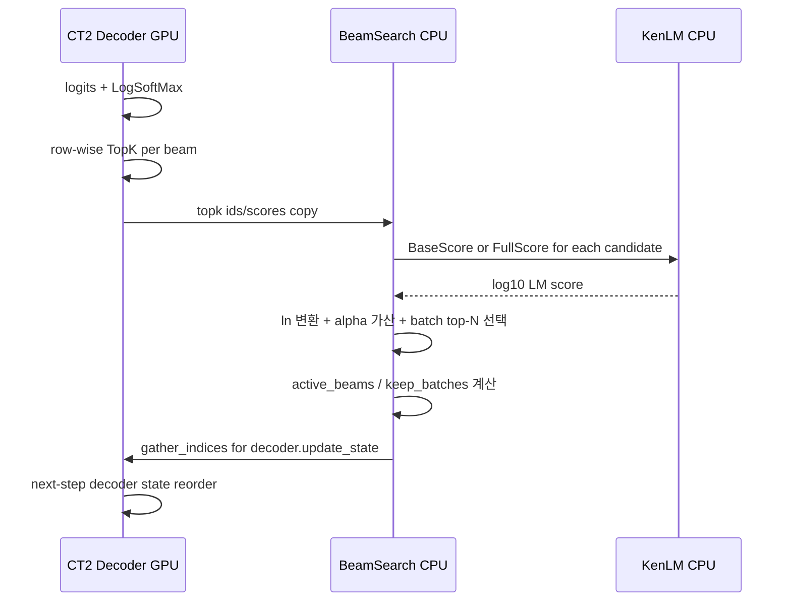

# CTranslate2 KenLM BPE shallow fusion 코드 통합 리서치

## Executive summary

첨부된 `CTranslate2-master.zip`의 로컬 라인 번호를 기준으로 보면, **가장 안전한 삽입 지점은 `src/decoding.cc::BeamSearch::search()`에서 `LogSoftMax`와 beam cumulative score broadcast가 끝난 직후, 기존 `reshape + sampler(...)` 직전**입니다. 이 지점은 현재 CT2가 GPU에서 logits와 TopK를 계산하고, 샘플링 결과를 CPU로 받는 구조와 가장 잘 맞습니다. `Sampler`는 출력이 CPU여야 하므로, **Whisper용 KenLM shallow fusion은 “GPU row-wise top-k → CPU KenLM score → CPU에서 fused top-N 선택 → 기존 beam update 경로 재사용”** 패턴이 최소 침습적입니다. citeturn4view9turn4view6turn7view6

핵심 리스크는 세 가지입니다. 첫째, **`Decoder::update_output_layer()`가 padding을 추가할 때 padded output id가 `to_original_word_id()`에서 0으로 매핑될 수 있어, LM이 pad를 실제 token 0으로 오인할 수 있습니다**. 둘째, **beam reorder, finished batch pruning, hard prefix 강제 단계에서 LM state 정렬이 한 step만 틀어져도 성능이 조용히 나빠질 수 있습니다**. 셋째, **`SearchStrategy` 인터페이스가 현재 LM scorer를 받지 않으므로, 이를 무리하게 전역 인터페이스로 넓히기보다 `BeamSearch` 생성자에 옵션과 scorer를 주입하는 쪽이 maintenance cost가 낮습니다.** citeturn8view0turn8view2turn4view6turn8view4

멀티스레드 관점에서는 **KenLM model 자체는 read-only 공유가 가능하고, KenLM 측 문서도 multithreaded Moses에서 fully threadsafe라고 설명**합니다. 반면 `State`는 반드시 request/beam local이어야 합니다. CT2의 `inter_threads`는 **한 요청의 beam search를 잘게 병렬화하는 값이 아니라, 복수 batch를 병렬 처리하는 worker/replica 수**에 가깝습니다. 따라서 `num_workers`를 올리면 GPU만이 아니라 CPU KenLM query pressure와 page fault 위험도 같이 올라갑니다. citeturn4view3turn4view1turn4view0turn9view2turn7view7

권장 시작값은 다음입니다. **`beam_size=5`, `num_hypotheses=1` 운영, `lm_fusion_mode=topk_strict`, `topk=50`, `alpha=0.10~0.15`, KenLM binary 사용, 기본 fallback은 `alpha<=0` 또는 `lm_path` 비어 있으면 CT2 baseline 경로로 완전 우회**입니다. 다중 고객사/다중 LM을 같이 올릴 계획이면 KenLM binary는 **우선 trie 계열을 기준으로 시작하고**, 단일 도메인 저지연 우선이면 probing도 별도 벤치마크하는 것이 좋습니다. probing이 더 빠르지만 메모리를 더 쓰고, trie는 메모리 locality가 좋고 메모리를 덜 씁니다. citeturn10view6turn10view4turn10view5turn4view3

## 전제와 확인된 코드 경로

이 보고서는 첨부된 소스 snapshot의 **로컬 line range**를 사용했습니다. 다만 **정확한 git commit SHA는 첨부물에 명시되지 않아 unspecified**로 두는 것이 안전합니다. 공식 문서는 현재 4.8.0 페이지를 제공하고 있으며, Whisper Python API에서 `inter_threads`를 “multiple batches in parallel”용 worker 수로 설명합니다. citeturn4view1turn4view0

코드 흐름상 Whisper는 `src/models/whisper.cc::WhisperReplica::generate()`에서 `_decoder->update_output_layer(_model->preferred_size_multiple())`를 호출하고, `DecodingOptions`를 채운 뒤 `decode(*_decoder, state, start_tokens, {_eot_id}, decoding_options)`로 들어갑니다. `decode()`는 output layer가 업데이트되었을 때 `start_tokens`, `end_ids`, disable ids를 output id space로 바꾸고, search가 끝난 뒤 다시 original id로 복원합니다. `BeamSearch::search()` 내부에서는 매 step마다 `convert_to_original_word_ids(decoder, topk_ids)`로 **다음 decoder input은 original id로 되돌린 뒤** forward를 수행합니다. citeturn8view3turn4view6turn9view7turn8view0

또 하나 중요한 구조는 샘플링 경계입니다. `Sampler` 인터페이스는 **sampled ids와 sampled scores가 CPU device여야 한다고 명시**하고, 실제 구현도 GPU에서 sample/TopK를 한 뒤 결과를 CPU로 copy합니다. 즉 KenLM이 CPU라는 사실 자체는 새 경계를 만드는 것이 아니라, **현재 CT2가 이미 CPU에 샘플링 결과를 가져오는 구조 위에 fusion을 얹는 것**에 가깝습니다. 다만 `topk_strict`용 per-row top-k 후보 개수를 늘리면 GPU→CPU로 가져오는 후보 tensor 양이 증가합니다. citeturn4view9turn4view6

## 기본 권장 설정

프로덕션 시작 설정은 **보수적이고 opt-out 가능한 구성이 가장 안전**합니다.

```text
beam_size                = 5
num_hypotheses           = 1
lm_fusion_mode           = topk_strict
lm_fusion_alpha          = 0.10 ~ 0.15
lm_fusion_asr_topk       = 50
lm_fusion_enabled        = (lm_path not empty && alpha > 0)
unsupported mode         = sampling / return_alternatives / random sampling
KenLM artifact           = .binary only
KenLM load strategy      = full preload on local SSD if RAM allows, else mmap-based lazy
inter_threads            = 1 per GPU/process부터 시작, profiling 후 2 검토
```

이 권장치는 CT2의 beam search 비용 구조와 KenLM의 binary/mmap·probing/trie 특성, 그리고 `inter_threads`가 parallel worker 수라는 점을 함께 고려한 값입니다. `BeamSearch`는 beam 수가 늘수록 decoding speed와 memory overhead가 증가하고, `return_alternatives`는 prefix 직후 top hypotheses를 별도 방식으로 전개하므로 v1 fusion 범위에서 빼는 편이 안전합니다. citeturn11view0turn4view1turn4view0turn10view6turn10view4

운영 fallback 정책은 두 층으로 나누는 것이 좋습니다. **라이브러리 층에서는 `alpha<=0` 또는 scorer 없음이면 baseline 경로를 그대로 타게 하고**, 서비스 층에서는 **LM load 실패, domain config mismatch, latency guard 초과** 시 request 단위로 fusion을 끄는 fail-open 옵션을 둡니다. KenLM 문서도 decoder integration에서 query code를 decoder에 맞게 reimplement하거나 include하는 방식을 권장하고 있어, optional dependency와 feature flag가 유지보수에 유리합니다. citeturn4view5turn7view4

## 질문별 답변

**질문 1. BeamSearch 내부에서 top-k candidate score를 수정하기 가장 안전한 위치는 어디인가?**  
**답:** `src/decoding.cc::BeamSearch::search()`의 **로컬 lines 549–563**, 즉 beam cumulative score broadcast 직후이자 기존 `log_probs.reshape({cur_batch_size, -1}); sampler(...);` 직전이 가장 안전합니다. 추가로 fusion이 켜질 때는 **로컬 lines 451–455의 `expand_after_first_step` 최적화도 끄는 것이 안전**합니다. 이 경로는 GPU logits/softmax와 기존 beam update를 유지하면서, sampling 출력이 CPU라는 CT2 기존 계약을 깨지 않습니다. citeturn4view6turn4view9turn7view6

위치 — `src/decoding.cc::BeamSearch::search()` local 549–563에 helper call 삽입, local 451–455에 `expand_after_first_step` 조건 수정.  
권장 구현 — `Sampler`는 그대로 두고, **새 helper**를 만드십시오. 이름은 예를 들어 `select_fused_candidates_topk_strict(...)`가 적절합니다.

```cpp
if (!lm_fusion_enabled) {
  log_probs.reshape({cur_batch_size, -1});
  sampler(log_probs, topk_ids, topk_scores, num_candidates);
} else {
  // log_probs shape: [rows = cur_batch_size * beam_size, vocab]
  topk_strict_fused_select(decoder,
                           log_probs,
                           cur_batch_size,
                           vocabulary_size,
                           num_candidates,
                           lm_states,
                           _lm_scorer,
                           _lm_opts,
                           topk_ids,      // CPU [cur_batch_size, num_candidates]
                           topk_scores,   // CPU fused cumulative scores
                           candidate_lm_states);
}
```

검증 — unit test는 `FakeLmScorer`로 충분합니다. **ASR rank 2지만 LM이 강하게 선호하는 token이 top-k 안일 때 최종 winner가 되는지**, **top-k 밖 token은 절대 rescue되지 않는지**, **fusion off일 때 기존 sampler 경로와 결과가 일치하는지**를 먼저 검증하십시오.  
성능 — 추가 비용은 대략 **per-step `beam_size * asr_topk`개의 KenLM query + batch별 partial sort**입니다. 반드시 `gpu_topk_us`, `cpu_fusion_us`, `gpu_to_cpu_bytes`, `kenlm_queries_total`, `selected_candidates`를 따로 계측하십시오.  
실패 모드 — fusion을 `sampler()` 뒤에 넣으면 이미 beam selection이 끝난 뒤라 의미가 없고, `LogitsProcessor`에 넣으면 beam-local LM state reorder가 어렵습니다. `expand_after_first_step`를 그대로 두면 step 0 shape가 달라져 state 정렬 버그가 납니다. citeturn4view6turn8view4

**질문 2. Whisper CT2에서 output id와 original Whisper token id 매핑은 어떻게 보장되는가?**  
**답:** 현재 CT2는 `Decoder::update_output_layer()`, `to_original_word_id()`, `to_output_word_id()`로 output/original 매핑을 관리하고, `decode()` 입구와 출구, 그리고 `BeamSearch::search()` 루프 입구에서 이 매핑을 사용합니다. 다만 **padding output id가 original 0으로 매핑될 수 있어, fusion 쪽에서는 “padded output id 검사”를 별도 추가해야 안전**합니다. citeturn8view0turn9view7turn9view0turn9view1

위치 — `include/ctranslate2/layers/decoder.h` local 54–73, `src/layers/decoder.cc` local 72–139, `src/decoding.cc` local 69–80, 1295–1304, 1320–1375, `src/models/whisper.cc` local 251–255.  
권장 구현 — `Decoder`에 **`effective_output_size()` 또는 `is_padding_output_id()`** accessor를 추가하십시오. 이게 v1에서 가장 중요한 안전장치입니다.

```cpp
// decoder.h
dim_t effective_output_size() const { return _effective_output_size; }
bool is_padding_output_id(size_t output_id) const {
  return output_layer_is_updated() && output_id >= _effective_output_size;
}
```

```cpp
// decoder.cc::update_output_layer()
_effective_output_size = ids.empty() ? _vocabulary_size : ids.size();
```

```cpp
// fusion helper
if (decoder.is_padding_output_id(out_id))
  continue;
size_t original_id = decoder.to_original_word_id(out_id);
```

검증 — `tests/model_test.cc` 스타일로 **padding이 있는 output layer**에서 `to_original_word_id()`가 실제 vocab id와 padded id를 어떻게 반환하는지 확인하는 test를 추가하십시오. 특히 **pad output id가 fusion에서 skip되는지**를 별도 테스트해야 합니다.  
성능 — accessor 추가 비용은 무시해도 됩니다.  
실패 모드 — pad id를 token 0으로 오인하면 LM이 `<|endoftext|>`나 일반 token 0에 잘못 가중치를 줄 수 있습니다. 또한 `restrict_ids`를 병행하는 모델 경로까지 지원하려면 “output id → original id”와 “pad 여부”를 분리해야 합니다. citeturn8view0turn9view1turn9view0

**질문 3. Beam reorder, finished beam 처리, batch pruning 시 external LM state를 어떻게 동기화해야 하는가?**  
**답:** **`active_beams`와 `non_finished_index`에 정확히 같은 순서로 LM state를 gather/prune**해야 합니다. 또한 hard prefix가 강제로 token을 덮어쓰는 step에서는 **fusion 자체를 건너뛰고 prefix token 기준으로만 state를 advance**하는 편이 안전합니다. Whisper prompt처럼 beam loop 밖에서 이미 decoder state에 들어간 prefix text가 있으면, **LM seed history를 `DecodingOptions`로 따로 넘겨야 parity가 맞습니다.** citeturn4view6turn11view0turn8view3

위치 — `src/decoding.cc::BeamSearch::search()` local 470–474, 565–589, 603–710. Whisper prompt replay는 `src/models/whisper.cc` local 265–291, 296–348.  
권장 구현 — `lm_states`는 **live beams와 1:1로 평행 배열**로 두고, 선택된 `num_candidates`에 대해서만 별도 `selected_candidate_states`를 계산한 뒤 `active_beams`로 gather하십시오. hard prefix가 적용되는 step이라면 fusion score는 쓰지 말고 state만 prefix token으로 갱신하는 것이 가장 안전합니다.

```cpp
// after topk_ids/topk_scores finalized and after update_sample_with_prefix if any
selected_candidate_states.resize(cur_batch_size * num_candidates);
for (dim_t i = 0; i < cur_batch_size; ++i) {
  for (dim_t k = 0; k < num_candidates; ++k) {
    int origin = gather_indices.at<int32_t>({i, k});
    const auto& prev = lm_states[origin];
    const auto token = topk_ids.at<int32_t>({i, k});   // final token after prefix override
    selected_candidate_states[i * num_candidates + k] = advance_or_copy(prev, token);
  }
}

// after active_beams decided
next_lm_states.resize(cur_batch_size * _beam_size);
for (dim_t n = 0; n < active_beams.size(); ++n)
  next_lm_states[n] = selected_candidate_states[active_beams.at<int32_t>(n)];
```

검증 — **beam reorder test**, **finished batch pruning test**, **hard-prefix step test**, **Whisper prompt replay parity test**를 분리하십시오. 특히 동일 history에 대해 HF reference scorer와 CT2 scorer가 같은 ranking을 내는 synthetic fixture가 필요합니다.  
성능 — state copy는 `lm::ngram::State`의 small struct copy 수준이라 상대적으로 가볍지만, step마다 `cur_batch_size * num_candidates`를 재계산하므로 `lm_state_copy_us`, `prefix_forced_steps`, `beam_reorders_total`을 세십시오.  
실패 모드 — 가장 흔한 버그는 **다른 beam의 state를 이어받는 조용한 drift**, **hard prefix override 뒤 점수/상태 불일치**, **previous text prompt 누락**입니다. mitigation은 hard prefix step bypass, `lm_initial_histories` 명시 전달, synthetic determinism test입니다. citeturn4view6turn11view0turn8view3

**질문 4. KenLM Model 객체는 multi-thread 환경에서 shared read-only로 안전하게 사용할 수 있는가?**  
**답:** **예, read-only model 공유는 권장 가능한 방향**입니다. KenLM 문서는 multithreaded Moses에서 fully threadsafe라고 밝히고 있고, `BaseScore`/`BaseFullScore` API도 caller-supplied state를 받습니다. 따라서 **공유 대상은 model**, **local 대상은 `State`와 scratch buffer**로 분리하는 설계가 맞습니다. 또한 KenLM 확장 포인트로는 `lm/model.hh` 또는 `lm/virtual_interface.hh` 사용이 공식 권장입니다. citeturn10view3turn7view0turn7view4

위치 — 새 파일 `include/ctranslate2/kenlm_fusion.h`, `src/kenlm_fusion.cc`; 서비스 캐시를 둘 경우 frontend/service 레이어.  
권장 구현 — v1은 **`LoadVirtual` 기반의 단순 shared model**로 시작하고, v2 최적화가 필요할 때만 `RecognizeBinary` 템플릿 분기로 바꾸는 것이 maintenance에 유리합니다.

```cpp
struct SharedLm {
  std::shared_ptr<const lm::base::Model> model;
  std::vector<lm::WordIndex> token_to_word;  // original token id -> t<ID> vocab index
};

thread_local lm::ngram::State tls_state_in;
thread_local lm::ngram::State tls_state_out;

// v1 fast path
float score_ln(const SharedLm& lm, const lm::ngram::State& s, lm::WordIndex w, lm::ngram::State* out) {
  constexpr float kLn10 = 2.302585093f;
  return lm.model->BaseScore(&s, w, out) * kLn10;
}
```

검증 — TSAN 또는 stress test로 **동일 model 공유 + 서로 다른 state** 조합에서 determinism이 유지되는지 확인하십시오. `BaseScore` 누적과 sentence score parity도 작은 fixture로 확인하십시오.  
성능 — model 공유는 RSS와 cold-start를 줄입니다. `shared_model_count`, `lm_load_ms`, `per_query_ns`, `minor/major page faults`, `llc_miss`를 함께 보십시오.  
실패 모드 — scratch/state를 model과 함께 공유하면 race가 납니다. 또한 lazy mmap은 network filesystem에서 tail latency를 키울 수 있습니다. RAM이 충분하면 full preload가 보통 더 낫고, local SSD가 아닐 때는 lazy loading을 신중히 써야 합니다. citeturn10view1turn10view0turn10view2turn4view3

**질문 5. `num_workers`와 `inter_threads` 사용 시 LM scorer를 replica별로 둘지, path별 shared cache로 둘지 어떤 구조가 좋은가?**  
**답:** CT2의 `inter_threads`/`num_workers`는 **parallel replica 수**이므로, **LM model은 path별 shared cache**, **beam/request state는 replica-local**이 가장 균형이 좋습니다. v1 안정화 단계에서는 replica별 scorer object를 두되 내부 model pointer만 공유하는 방식이 좋습니다. citeturn4view1turn4view0turn9view2turn7view7

위치 — `python/cpp/whisper.cc` local 177–217, `python/cpp/replica_pool.h` local 41–69, `include/ctranslate2/replica_pool.h` local 57–112.  
권장 구현 — 프로세스 단일체에서 `lm_path -> weak_ptr<SharedLm>` 캐시를 두고, `WhisperReplica::generate()` 또는 service frontend에서 lookup하십시오.

```cpp
class KenlmCache {
public:
  std::shared_ptr<const SharedLm> get(const std::string& path, const KenlmLoadOpts& opts);
private:
  std::mutex mu_;
  std::unordered_map<std::string, std::weak_ptr<const SharedLm>> cache_;
};
```

검증 — 동일 path를 worker 2개 이상이 동시에 열 때 **1회 load만 일어나는지**, 다른 customer/domain path는 분리되는지, unload/evict 후 reload가 정상인지 테스트하십시오.  
성능 — `cache_hit_rate`, `loaded_lm_count`, `first_request_load_ms`, `rss_shared_mb`, `rss_private_mb`, `num_workers`별 throughput을 보십시오.  
실패 모드 — 고객사별 LM을 worker마다 중복 로드하면 `num_workers × domains`만큼 RAM이 폭증합니다. 반대로 지나친 글로벌 공유는 cache stampede와 lifecycle bug를 부를 수 있습니다. mitigation은 mutex+weak_ptr, LRU cap, per-domain admission control입니다. citeturn4view1turn4view0turn4view3

**질문 6. KenLM binary 크기와 order가 decoding latency와 memory에 미치는 영향은 어느 정도인가?**  
**답:** 절대 수치는 **LM artifact와 load policy가 지정되지 않아 unspecified**입니다. 다만 방향성은 분명합니다. KenLM은 **binary가 ARPA보다 로딩이 빠르고 mmap을 지원**하며, **probing은 fastest but more memory**, **trie는 less memory and good locality**라는 특성이 있습니다. 따라서 order와 binary 구조가 커질수록 CPU cache locality, page fault, load time, per-query latency 모두 영향을 받습니다. citeturn10view6turn10view4turn10view5turn10view2

위치 — CT2 core 변경보다 **별도 benchmark harness**가 핵심입니다. 권장 파일은 `tests/lm_fusion_bench.cc` 신규 추가, 또는 service microbenchmark. KenLM load tuning은 `lm::ngram::Config.load_method` 사용. citeturn7view1turn7view2  
권장 구현 — 최소 비교축은 **order 3/4/5 × probing/trie × load_method(LAZY, POPULATE_OR_READ) × topk 32/50/100**입니다.

```cpp
lm::ngram::Config cfg;
cfg.load_method = util::POPULATE_OR_READ;  // or LAZY
auto* model = lm::ngram::LoadVirtual(path.c_str(), cfg);
```

검증 — warm/cold load를 분리해서 `lm_load_ms_cold`, `lm_load_ms_warm`, `rss_delta_mb`, `per_query_ns`, `major_page_faults`, `decode_p50/p95`를 측정하십시오.  
성능 — candidate scoring은 step당 `beam_size * topk`에 거의 비례하므로, 큰 order·큰 binary·topk 증가가 겹치면 tail latency가 먼저 악화됩니다.  
실패 모드 — ARPA를 실수로 운영에 올리거나, lazy mmap을 network filesystem에서 쓰거나, 큰 probing LM 여러 개를 동시에 올리면 latency와 RSS가 급격히 흔들립니다. mitigation은 **binary-only allowlist**, **local SSD**, **prewarm**, **도메인 수 cap**입니다. citeturn10view2turn7view1turn10view4

**질문 7. `topk_strict=32/50/100`에서 latency와 품질의 trade-off는 어디가 production 기본값으로 적합한가?**  
**답:** **기본값은 50**이 가장 무난합니다. 32는 CPU 비용이 가장 낮지만 first subtoken miss를 더 자주 놓칠 가능성이 있고, 100은 recall ceiling은 조금 더 높을 수 있지만 Query 수가 50의 2배가 되어 CPU fusion 구간이 병목이 되기 쉽습니다. 이는 `topk_strict`가 **top-k 밖 token을 절대 rescue하지 않는 구조**라는 점에서 나오는 추론입니다. citeturn4view6turn10view4turn10view5

위치 — 새 fusion helper와 Whisper public option (`include/ctranslate2/models/whisper.h`, `python/cpp/whisper.cc`)에 `lm_fusion_asr_topk` 노출.  
권장 구현 — `topk`는 실험값이 아니라 **runtime option**이어야 합니다. 운영은 50, offline sweep은 32/50/100 권장입니다.

```cpp
struct LmFusionOptions {
  float alpha = 0.f;
  size_t asr_topk = 50;
  bool enabled = false;
};
```

검증 — 동일 subset에서 **CER/WER/term recall + insertion/hallucination + p50/p95 latency**를 함께 기록하십시오. 특히 **“gold first token이 ASR rank 몇 위였는가”**를 수집하면 topk 32/50/100 선택이 매우 쉬워집니다.  
성능 — beam=5 기준 step당 KenLM query 수는 **160 / 250 / 500**입니다. avg decode steps가 80이면 utterance당 대략 **12,800 / 20,000 / 40,000** query 수준입니다.  
실패 모드 — 32는 품질 바닥, 100은 CPU 병목, 50은 그 중간입니다. 만약 error analysis에서 top-50 밖에 gold first token이 자주 있다면 100으로 올리거나, 장기적으로는 union/domain-successor 확장을 고려해야 합니다. 

**질문 8. CT2 fork 유지보수 부담을 줄이기 위한 최소 침습 patch 구조는 무엇인가?**  
**답:** **`SearchStrategy::search` 시그니처는 건드리지 말고**, `DecodingOptions`에 fusion 옵션과 scorer를 추가한 뒤 **`BeamSearch` 생성자에만 주입**하는 구조가 가장 유지보수 친화적입니다. Public API는 Whisper 쪽에만 노출하고, core에서 generic하게 동작하되 default는 완전 off로 두십시오. KenLM은 `WITH_KENLM` compile flag로 optional dependency로 묶는 것이 안전합니다. citeturn8view4turn9view3turn4view5turn7view4

위치 — `include/ctranslate2/decoding.h` local 54–86, 139–166; `src/decoding.cc` local 1023–1088, 1312–1367; `include/ctranslate2/models/whisper.h` local 11–59; `python/cpp/whisper.cc` local 32–80 and 242–297; `CMakeLists.txt` local 10–25 and 110–220.  
권장 구현 — 새 파일 두 개만 추가하고 core 변경을 작은 branch로 묶으십시오.

```cpp
// decoding.h
struct LmFusionOptions {
  bool enabled = false;
  float alpha = 0.f;
  size_t asr_topk = 50;
};

struct DecodingOptions {
  ...
  std::shared_ptr<const LmFusionScorer> lm_scorer;
  LmFusionOptions lm_fusion;
};

class BeamSearch : public SearchStrategy {
public:
  BeamSearch(dim_t beam_size,
             float length_penalty = 0,
             float coverage_penalty = 0,
             float prefix_bias_beta = 0,
             float patience = 1,
             std::shared_ptr<const LmFusionScorer> lm_scorer = nullptr,
             LmFusionOptions lm_fusion = {});
private:
  std::shared_ptr<const LmFusionScorer> _lm_scorer;
  LmFusionOptions _lm_fusion;
};
```

```cpp
// make_search_strategy(options)
return std::make_unique<BeamSearch>(options.beam_size,
                                    options.length_penalty,
                                    options.coverage_penalty,
                                    options.prefix_bias_beta,
                                    options.patience,
                                    options.lm_scorer,
                                    options.lm_fusion);
```

검증 — **fusion off면 baseline bitwise parity 또는 near-parity**, **unsupported mode(validation) test**, **build with `WITH_KENLM=OFF` test**, **Python API surface test**가 필요합니다.  
성능 — 시그니처 보존은 compile ripple을 줄이고, feature off 경로의 runtime overhead를 거의 0으로 유지합니다.  
실패 모드 — `SearchStrategy` 인터페이스를 넓히면 Greedy/Alternatives/Translator path까지 연쇄 수정이 필요해 fork 추적 비용이 커집니다. `return_alternatives`는 CT2 문서상 prefix 직후 후보들을 별도 확장한 뒤 각 hypothesis를 독립 완료하는 모드이므로 v1에서 막는 것이 맞습니다. citeturn11view0turn8view4

## top-k 비교와 데이터 흐름

아래 표는 **beam size 5** 기준의 운영 관점 비교입니다. latency와 품질은 **예상값**이며, query 수는 구조상 정확한 계산식입니다.

| topk | step당 KenLM queries | CPU fusion work량 상대치 | 예상 latency 영향 | 예상 품질 특성 | 운영 판단 |
|---|---:|---:|---|---|---|
| 32 | 160 | 1.00 | 가장 낮음 | first subtoken miss 가능성 큼 | CPU budget이 매우 타이트할 때만 |
| 50 | 250 | 1.56 | 중간 | 품질/속도 균형이 가장 좋을 가능성 | **기본 권장값** |
| 100 | 500 | 3.13 | 높음 | recall ceiling 탐색엔 유리, 체감 이득은 체감형 | offline sweep 또는 특정 도메인 한정 |

이 표는 `topk_strict`에서 후보 수가 step당 `beam_size × topk`로 늘고, 각 후보마다 KenLM score를 한 번 계산한다는 점에 근거한 추론입니다. 실제 wall-clock은 LM size, probing/trie, mmap/full preload, `num_workers`에 따라 달라지므로 반드시 p50/p95로 재보아야 합니다. citeturn4view6turn10view4turn10view5turn4view3



추천 계측 항목은 최소한 다음 정도는 있어야 합니다. `kenlm_queries_total`, `gpu_topk_us`, `cpu_fusion_us`, `decoder_update_state_us`, `lm_load_ms`, `rss_delta_mb`, `major_page_faults`, `fallback_count`, `first_token_rank_histogram`. CT2는 profiling 매크로를 이미 제공하므로 fusion helper에 별도 `PROFILE("lm_fusion")` 구간을 두는 것이 좋습니다. citeturn4view6turn4view0turn4view1

## 결론

결론만 압축하면, **CT2 KenLM BPE-token shallow fusion은 구현 가능성이 높고, 현재 CT2 구조와도 잘 맞습니다.** 다만 성공의 관건은 “KenLM을 어디에 붙이느냐” 자체보다, **pad output id 처리**, **beam state 동기화**, **Whisper prompt replay**, **feature-off parity** 네 가지를 처음부터 정확히 잡는 데 있습니다. citeturn4view6turn8view0turn8view3

바로 적용할 액션은 세 가지입니다. 첫째, `BeamSearch::search()`에 **새 helper를 추가하되 `Sampler`와 `SearchStrategy`는 최대한 유지**하십시오. 둘째, `Decoder`에 **padding output id accessor**를 추가하십시오. 셋째, `DecodingOptions`에 **Whisper prompt replay용 LM initial history**를 넣고, hard prefix step은 fusion을 우회하십시오. 이 세 가지를 먼저 해두면, 이후의 topk/alpha sweep과 multi-worker 튜닝이 훨씬 안전해집니다. citeturn8view4turn4view6turn9view0

운영 기본안으로는 **Whisper-only public API + generic internal scorer, `WITH_KENLM` optional build, `topk_strict=50`, `alpha=0.10~0.15`, `beam_size=5`, `num_hypotheses=1`, binary KenLM, feature-off baseline parity 보장**을 권장합니다. exact CT2 commit, 실제 KenLM artifact size, 빌드/배포 정책은 본 요청 범위에서는 일부 unspecified이므로, 최종 배포 전에는 반드시 **local source snapshot + 실측 benchmark**로 마감하는 것이 맞습니다. citeturn4view5turn10view6turn4view1turn4view0